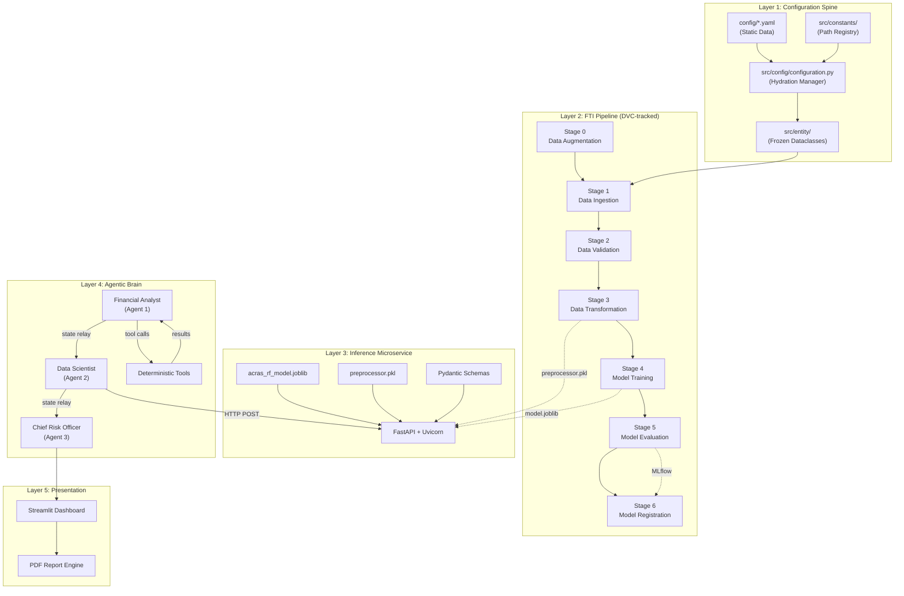
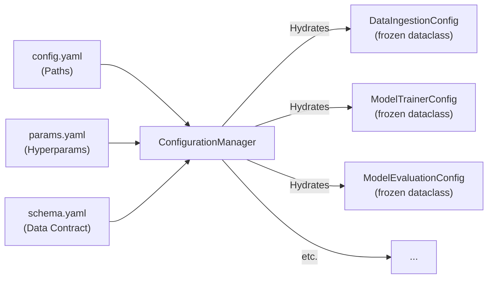
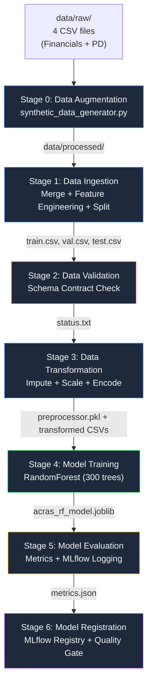
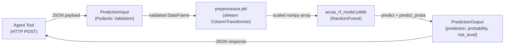
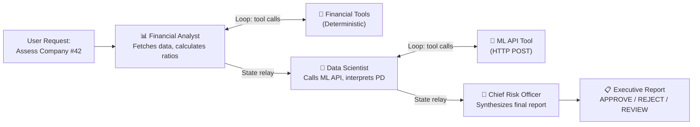
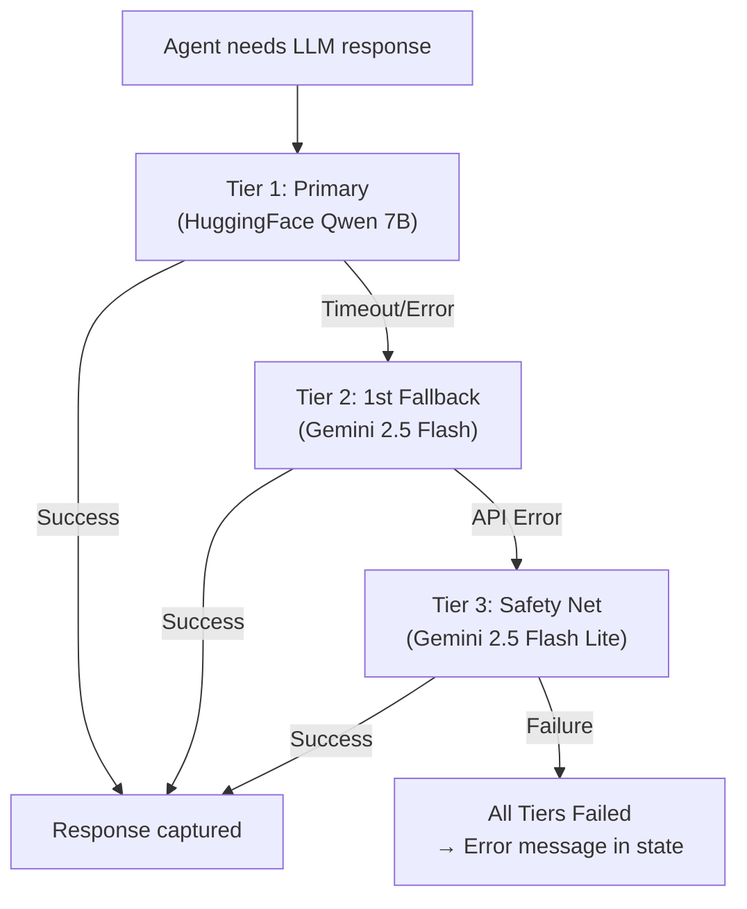
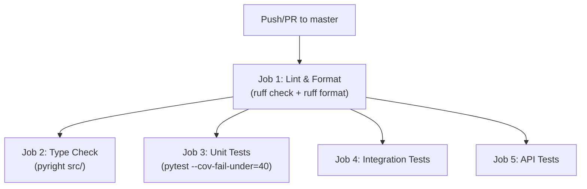

# ACRAS: Systems-Thinking Architecture Walkthrough

> **"The Brain (Agent) directs; The Hands (Tools) execute."**


---

## Table of Contents

1. [The 30-Second Elevator Pitch](#1-the-30-second-elevator-pitch)
2. [Why This System Exists — The Business Problem](#2-why-this-system-exists)
3. [The Two Worlds: Deterministic vs. Probabilistic](#3-the-two-worlds)
4. [Architecture Map: Every Building Block](#4-architecture-map)
5. [The Configuration Spine — Why Everything Starts Here](#5-the-configuration-spine)
6. [The FTI Pipeline — How the Model Gets Built](#6-the-fti-pipeline)
7. [The Inference Microservice — Where ML Meets HTTP](#7-the-inference-microservice)
8. [The Agentic Brain — LangGraph Orchestration](#8-the-agentic-brain)
9. [Data Flow: End-to-End Trace](#9-data-flow-end-to-end)
10. [Failure Modes & Resilience Architecture](#10-failure-modes--resilience)
11. [The Two Critical Integration Points](#11-the-two-critical-integration-points)
12. [Key Engineering Tradeoffs](#12-key-engineering-tradeoffs)
13. [Quality Gates & Production Readiness](#13-quality-gates)
14. [What Separates "I Built It" from "I Understand Why It Works"](#14-what-separates-knowledge)

---

## 1. The 30-Second Elevator Pitch

ACRAS is a **Hybrid Agentic MLOps System** for corporate credit risk assessment. It combines:

- A **deterministic ML pipeline** (RandomForest trained on financial data) that produces a Probability of Default (PD)
- A **probabilistic agentic layer** (LangGraph with 3 specialized AI agents) that reasons about what that PD *means* in business context

The result: an executive-grade risk assessment report that no standalone ML model or standalone LLM could produce alone.

> [!IMPORTANT]
> The core insight: **ML models are excellent at quantifying risk but terrible at explaining it.** LLMs are excellent at explanation but terrible at computation. ACRAS fuses both by making the LLM *orchestrate* the ML model rather than replace it.

---

## 2. Why This System Exists

### The Problem with Traditional Credit Scoring

A traditional credit scoring system outputs a number: *"PD = 0.23, Risk: Medium."* That's useful for automated decisioning on consumer loans, but **corporate credit decisions** are categorically different:

- They involve millions of dollars per decision
- They require **narrative justification** for audit trails
- They demand correlation between financial ratios, market context, and credit behavior
- A board member needs to *understand* why the recommendation is APPROVE/REJECT/REVIEW

### The Problem with Pure LLM Approaches

Sending a financial statement to ChatGPT and asking "should we lend to this company?" is dangerous because:

- LLMs **hallucinate math** — they'll calculate a Debt-to-Equity ratio incorrectly
- LLMs have **no access to your proprietary model** — they can't produce your company's calibrated PD
- LLMs are **non-deterministic** — the same input may yield different risk scores on different runs

### The ACRAS Solution: Hybrid Architecture

```
┌──────────────────────┐     ┌──────────────────────┐
│   DETERMINISTIC      │     │   PROBABILISTIC      │
│   ────────────────   │     │   ──────────────────  │
│   ML Model (RF)      │     │   LLM Agents         │
│   Financial Tools    │────▶│   (LangGraph)        │
│   Pydantic Schemas   │     │   System Prompts     │
│   Exact math         │     │   Business narrative │
└──────────────────────┘     └──────────────────────┘
         ▲                            │
         │                            ▼
         │                   ┌──────────────────┐
         └───────────────────│  Executive Report │
                             │  (APPROVE/REJECT) │
                             └──────────────────┘
```

> [!TIP]
> **The mental model:** The ML pipeline is the "lab" that produces calibrated measurements. The agentic layer is the "doctor" that interprets those measurements, correlates them with patient history, and writes the diagnosis.

---

## 3. The Two Worlds

### World 1: Deterministic (The Hands)

Everything that must produce the **exact same output** for the same input, every time:

| Component | Why Deterministic | Implementation |
|:---|:---|:---|
| Financial ratio calculators | Math cannot be approximate | [finance_tool.py](file:///c:/Users/sebas/Desktop/hybrid-agentic-ml-for-risk-assessment/src/agents/tools/finance_tool.py) |
| ML prediction API | Model inference is stateless | [endpoints.py](file:///c:/Users/sebas/Desktop/hybrid-agentic-ml-for-risk-assessment/src/app/api/endpoints.py) |
| Data preprocessing | Training-serving skew kills models | [data_transformation.py](file:///c:/Users/sebas/Desktop/hybrid-agentic-ml-for-risk-assessment/src/components/data_transformation.py) |
| Pydantic schemas | Invalid data must be rejected before inference | [schemas.py](file:///c:/Users/sebas/Desktop/hybrid-agentic-ml-for-risk-assessment/src/app/schemas.py) |
| Data validation | Schema drift detection | [data_validation.py](file:///c:/Users/sebas/Desktop/hybrid-agentic-ml-for-risk-assessment/src/components/data_validation.py) |

### World 2: Probabilistic (The Brain)

Everything that involves **reasoning, synthesis, and natural language**:

| Component | Why Probabilistic | Implementation |
|:---|:---|:---|
| Financial Analyst Agent | Interprets what ratios mean | [graph.py:financial_analyst_node](file:///c:/Users/sebas/Desktop/hybrid-agentic-ml-for-risk-assessment/src/agents/graph.py#L228-L244) |
| Data Scientist Agent | Explains what the PD means | [graph.py:data_scientist_node](file:///c:/Users/sebas/Desktop/hybrid-agentic-ml-for-risk-assessment/src/agents/graph.py#L247-L276) |
| CRO Agent | Synthesizes the final directive | [graph.py:orchestrator_node](file:///c:/Users/sebas/Desktop/hybrid-agentic-ml-for-risk-assessment/src/agents/graph.py#L279-L295) |
| System prompts | Control agent behavior | [prompts.py](file:///c:/Users/sebas/Desktop/hybrid-agentic-ml-for-risk-assessment/src/agents/prompts.py) |

> [!CAUTION]
> **The cardinal rule (Rule 1.2):** NEVER let the LLM do math. All division, ratio calculation, and numerical computation is wrapped in deterministic Tools with Pydantic input validation. The LLM *calls* the tool; the tool *returns* the result.

---

## 4. Architecture Map



### Why This Layering Matters

Each layer is **independently deployable and testable**:

- **Layer 1** changes when you add a new hyperparameter → no code changes, just YAML
- **Layer 2** runs via `dvc repro` → completely independent of the API or agents
- **Layer 3** runs in Docker → completely independent of the training pipeline
- **Layer 4** swaps LLM providers at runtime → no redeployment needed
- **Layer 5** is a pure consumer → reads state, never writes to upstream layers

---

## 5. The Configuration Spine

### Why Configuration Is the Foundation

> In a production ML system, the most common cause of bugs is not logic errors — it's **configuration drift**. A path changes, a hyperparameter is hardcoded in two places, or a training environment uses different settings than production.

ACRAS addresses this with a strict 3-file + 1-manager architecture:

```
config/
├── config.yaml    → WHERE things live (paths, never values)
├── params.yaml    → HOW the model behaves (hyperparameters, thresholds)
└── schema.yaml    → WHAT the data looks like (column contract)
```

### The Hydration Flow



**Why `frozen=True` dataclasses?** Because once a config entity is constructed, no component downstream should be able to mutate it. This prevents a subtle class of bugs where a pipeline stage accidentally modifies a shared configuration object.

**Why three separate YAML files instead of one?** Separation of concerns:
- A **data engineer** touches `schema.yaml` when the data contract changes
- A **data scientist** touches `params.yaml` when tuning hyperparameters  
- An **ML engineer** touches `config.yaml` when restructuring artifacts

They never step on each other's toes.

### Key Files

| File | Role | Key Insight |
|:---|:---|:---|
| [constants/__init__.py](file:///c:/Users/sebas/Desktop/hybrid-agentic-ml-for-risk-assessment/src/constants/__init__.py) | Path registry pointing to the 3 YAML files | Single source of truth for config locations |
| [config_entity.py](file:///c:/Users/sebas/Desktop/hybrid-agentic-ml-for-risk-assessment/src/entity/config_entity.py) | 6 frozen dataclasses with explicit typing | No untyped dicts cross boundaries |
| [configuration.py](file:///c:/Users/sebas/Desktop/hybrid-agentic-ml-for-risk-assessment/src/config/configuration.py) | Reads YAML → creates typed entities | The "factory" — one place that knows how to assemble configs |

---

## 6. The FTI Pipeline

### The Big Picture: 7 DVC-Tracked Stages

The training pipeline is an **assembly line** — each stage takes a well-defined input, produces a well-defined output, and the next stage picks up from there. DVC records MD5 hashes of every input and output, so **any change anywhere** is automatically detected and the affected downstream stages are re-executed.



### Stage-by-Stage Deep Dive

#### Stage 0: Data Augmentation — *Why Synthesize?*

**File:** [synthetic_data_generator.py](file:///c:/Users/sebas/Desktop/hybrid-agentic-ml-for-risk-assessment/src/tools/synthetic_data_generator.py)

**The problem:** In credit risk data, defaults (companies that failed to repay) are **extremely rare** — typically 2-5% of all records. This creates a severe class imbalance that causes models to predict "no default" for nearly everything and still achieve 95%+ accuracy.

**The solution:** Generate 50 synthetic "distressed company" profiles with deliberately unhealthy financial signatures:
- **Negative EBITDA margins** (-15% to +5%)
- **High leverage** (Debt-to-Equity: 2x-5x)
- **Low liquidity** (Current Ratio < 0.9)
- **Low bureau scores** (300-550)
- **High delinquency** (10%-40%)

**The key design decision:** Raw data in `data/raw/` is **never modified**. Augmented data goes to `data/processed/`. This preserves data lineage and allows DVC to version both independently.

> [!NOTE]
> **Why not SMOTE?** SMOTE works well for tabular data interpolation, but for this domain, hand-crafted synthetic defaults are more interpretable. You can explicitly define what a "distressed company" looks like based on domain expertise (high leverage + negative margins + young company). This is a conscious tradeoff: interpretability over statistical elegance.

---

#### Stage 1: Data Ingestion — *The Most Complex Stage*

**File:** [data_ingestion.py](file:///c:/Users/sebas/Desktop/hybrid-agentic-ml-for-risk-assessment/src/components/data_ingestion.py)

This stage solves three non-trivial problems:

**Problem 1: Cartesian Product Prevention**
Raw data arrives as two separate tables (Financial Statements and PD tables) with a many-to-many relationship through `id_empresa`. A naive merge would explode the dataset. The solution:
- Financial Statements → Aggregate by **latest year** per company
- PD Table → Aggregate by **mean** of numerical columns per company
- Then inner join on `id_empresa`

**Problem 2: Feature Engineering (Training-Serving Parity)**
The [build_features.py](file:///c:/Users/sebas/Desktop/hybrid-agentic-ml-for-risk-assessment/src/features/build_features.py) module is called from here. It computes:
- `ebitda_margin` = EBITDA / Revenue
- `debt_to_equity` = Total Liabilities / Equity  
- `current_ratio` = (Cash + Receivables + Inventory) / Payables

> [!WARNING]
> **Training-Serving Skew Alert:** These exact same ratio formulas are hardcoded in the `PredictionInput` schema fields. If you change the formula in `build_features.py` without updating the inference schema, the model will silently degrade in production.

**Problem 3: Stratified Splitting with Graceful Fallback**
The system attempts stratified splitting (preserving class ratios across train/val/test), but handles the case where there are too few positive samples to stratify:

```python
try:
    train_set, temp_set = train_test_split(..., stratify=strat_col)
except ValueError:
    # Fallback to random split if too few positives
    train_set, temp_set = train_test_split(..., stratify=None)
```

This is resilience engineering — the pipeline doesn't crash on edge cases, it adapts.

---

#### Stage 2: Data Validation — *The Quality Gate*

**File:** [data_validation.py](file:///c:/Users/sebas/Desktop/hybrid-agentic-ml-for-risk-assessment/src/components/data_validation.py)

**Why it exists:** To prevent "garbage in, garbage out." This stage checks:
1. Every column in the training data exists in `schema.yaml`
2. Every column defined in `schema.yaml` exists in the training data

If either check fails, a `status.txt` file is written with the failure reason, and the pipeline halts. This is a **data contract** — a formalized agreement between the data producer and the model consumer.

---

#### Stage 3: Data Transformation — *The Preprocessor*

**File:** [data_transformation.py](file:///c:/Users/sebas/Desktop/hybrid-agentic-ml-for-risk-assessment/src/components/data_transformation.py)

**The critical output:** `preprocessor.pkl` — a serialized `ColumnTransformer` that:
- Imputes missing values with **median** (robust to outliers)
- Scales features with **RobustScaler** (uses IQR, not mean/std, so outliers don't dominate)
- Is fitted **only on training data** and applied to val/test

> [!IMPORTANT]
> **Why RobustScaler, not StandardScaler?** Financial data is full of extreme outliers (a company with $10B revenue next to one with $500K). StandardScaler would let these outliers warp the mean and standard deviation, distorting all other companies. RobustScaler uses the interquartile range, making it immune to extreme values.

**The preprocessor is the bridge between training and inference.** The same `.pkl` file is:
1. Produced here during training
2. Loaded by the FastAPI service during inference
3. Baked into the Docker image

---

#### Stage 4: Model Training — *The Simplest Stage (By Design)*

**File:** [model_trainer.py](file:///c:/Users/sebas/Desktop/hybrid-agentic-ml-for-risk-assessment/src/components/model_trainer.py)

Only 68 lines. This is intentional. The model trainer does exactly one thing: fit a `RandomForestClassifier` and save it.

**Why RandomForest for credit risk?**
- **Interpretability**: Feature importances are native and easy to explain to risk officers
- **Robustness**: Ensemble of 300 trees averages out individual tree errors
- **Class imbalance handling**: `class_weight='balanced'` automatically upweights the minority (default) class
- **No GPU needed**: This is a production constraint — not every deployment target has GPU access

All hyperparameters come from `params.yaml`, not hardcoded values. This means a data scientist can tune the model by editing a YAML file and running `dvc repro` — no code changes.

---

#### Stage 5: Model Evaluation — *MLflow Integration*

**File:** [model_evaluation.py](file:///c:/Users/sebas/Desktop/hybrid-agentic-ml-for-risk-assessment/src/components/model_evaluation.py)

This stage serves two masters:
1. **DVC** — writes `metrics.json` as a tracked output (enables `dvc metrics diff`)
2. **MLflow** — logs parameters, metrics, ROC plots, and model artifacts for experiment tracking

**Fault-tolerant MLflow logging:** If the MLflow server is unreachable, the pipeline **doesn't crash**. It falls back to local `./mlruns` storage. This is critical because you don't want a training pipeline to fail because the tracking server is temporarily down.

```python
# The evaluation ALWAYS writes metrics.json first (for DVC)
save_json(path=Path(self.config.metric_file_name), data=scores)

# Then OPTIONALLY logs to MLflow (fault-tolerant)
try:
    with mlflow.start_run(run_name=run_name):
        mlflow.log_metrics(scores)
except Exception as e:
    logger.warning(f"MLflow logging failed but pipeline continues: {e}")
```

---

#### Stage 6: Model Registration — *The Quality Gatekeeper*

**File:** [model_registration.py](file:///c:/Users/sebas/Desktop/hybrid-agentic-ml-for-risk-assessment/src/components/model_registration.py)

**Why it's separate from evaluation:** Separation of concerns. Evaluation tells you *how good* the model is. Registration decides *whether to promote it*. 

The quality gate: `roc_auc >= 0.60` (configurable in `params.yaml`). If the model doesn't meet this threshold, it is **not registered** — it won't be deployed, even if the pipeline ran successfully. This prevents bad models from reaching production.

---

## 7. The Inference Microservice

### Why a Microservice?

> If the training pipeline and the inference service are the same process, you can't scale, update, or debug them independently. When the model needs retraining, you don't want to take down the prediction API. When the API has a bug, you don't want to corrupt the training pipeline.

### The Runtime Architecture



### Key Design Decisions

**File:** [FastAPI main.py](file:///c:/Users/sebas/Desktop/hybrid-agentic-ml-for-risk-assessment/src/app/main.py)

1. **Lifespan-based artifact loading:** The model and preprocessor are loaded once at startup via `asynccontextmanager`, not per-request. This avoids disk I/O on every prediction.

2. **State stored in `app.state`:** No global variables. This is the FastAPI-recommended pattern and works correctly with Uvicorn workers.

3. **Prometheus instrumentation:** `Instrumentator().instrument(app).expose(app)` gives you `/metrics` endpoint for free — request count, latency histograms, and error rates.

**File:** [schemas.py](file:///c:/Users/sebas/Desktop/hybrid-agentic-ml-for-risk-assessment/src/app/schemas.py)

The `PredictionInput` schema uses **field aliases** to bridge the semantic gap between internal column names (Spanish: `ingresos`, `pasivos_totales`) and external API names (English: `annual_revenue`, `total_liabilities`). This means:
- The API speaks English (for agents and external consumers)
- The preprocessor receives Spanish column names (matching the training data)
- `model_config = ConfigDict(populate_by_name=True)` enables both

**File:** [endpoints.py](file:///c:/Users/sebas/Desktop/hybrid-agentic-ml-for-risk-assessment/src/app/api/endpoints.py)

The `/predict` endpoint interprets the raw probability into a business-meaningful risk level:

```python
if probability < 0.3:   risk_level = "Low"
elif probability < 0.7:  risk_level = "Medium"
else:                     risk_level = "High"
```

> [!NOTE]
> These thresholds (0.3, 0.7) are currently hardcoded in the endpoint. In a production system, they'd be in `params.yaml` and loaded via the ConfigurationManager, allowing risk officers to adjust sensitivity without code changes.

---

## 8. The Agentic Brain

### The Sequential Agent Pattern (Relay Team)

ACRAS uses a **Sequential Agent Pattern** — a structured relay where each agent's output becomes the next agent's context. This is deliberately *not* a coordinator pattern because credit risk assessment is a **highly repeatable workflow** where the order of analysis matters:

1. First, you **gather data** (Financial Analyst)
2. Then, you **quantify risk** (Data Scientist)
3. Finally, you **synthesize the recommendation** (CRO)



### The State Machine

**File:** [graph.py](file:///c:/Users/sebas/Desktop/hybrid-agentic-ml-for-risk-assessment/src/agents/graph.py)

The `AgentState` is a `TypedDict` with two fields:
- `messages: list[BaseMessage]` — Accumulated conversation (uses `operator.add` for append-only semantics)
- `company_id: str` — The target entity, passed through without modification

The graph has 5 nodes and conditional edges:

```python
workflow.set_entry_point("financial_analyst")

# Financial Analyst loops with tools until done, then → Data Scientist
workflow.add_conditional_edges("financial_analyst", route_financial_analyst)
workflow.add_edge("financial_tools", "financial_analyst")  # Tool → Analyst loop

# Data Scientist loops with ML tool until done, then → CRO
workflow.add_conditional_edges("data_scientist", route_data_scientist)
workflow.add_edge("ml_tools", "data_scientist")  # Tool → Scientist loop

# CRO → END
workflow.add_edge("orchestrator", END)
```

The routing logic is simple: if the agent's last message contains `tool_calls`, route to the tool node. Otherwise, advance to the next agent.

### The 3 Agents in Detail

#### Agent 1: Financial Analyst

**Tools available:**
- `fetch_company_data` — Reads `val.csv` and returns raw financial metrics
- `calculate_debt_to_equity` — Deterministic: Total Liabilities / Equity
- `calculate_ebitda_margin` — Deterministic: EBITDA / Revenue
- `calculate_current_ratio` — Deterministic: Current Assets / Current Liabilities
- `calculate_revenue_growth` — Deterministic: (Current - Previous) / Previous × 100

**Why tools instead of letting the LLM calculate?** Because LLMs make arithmetic errors approximately 20-30% of the time on multi-step financial calculations. A `calculate_debt_to_equity` tool with Pydantic validation will **never** produce 2.34 when the answer is 3.21.

#### Agent 2: Data Scientist

**Tools available:**
- `get_credit_risk_score` — HTTP POST to the FastAPI inference service

**Critical design decision:** The agent is *forced* to call the ML API tool before providing analysis:

```python
# Force tool usage if it hasn't been called yet
has_called_ml = any(
    hasattr(m, "name") and m.name == "get_credit_risk_score" for m in messages
)
current_tool_choice = "any" if not has_called_ml else None
```

This prevents the LLM from "hallucinating" a PD score. It must obtain the real score from the ML model.

#### Agent 3: CRO (Orchestrator)

**Tools available:** None. The CRO has no tools because its job is pure synthesis — it reads the accumulated state from both previous agents and produces the final executive report.

### The Model Factory & Hot-Swap Architecture

**Files:** [config.py](file:///c:/Users/sebas/Desktop/hybrid-agentic-ml-for-risk-assessment/src/agents/config.py), [model_factory.py](file:///c:/Users/sebas/Desktop/hybrid-agentic-ml-for-risk-assessment/src/agents/model_factory.py)

The `AgentSettings` class uses `pydantic-settings` to load from `.env`:

```python
DEFAULT_LLM_PROVIDER: Literal["gemini", "huggingface"] = "huggingface"
HF_MODEL: str = "Qwen/Qwen2.5-7B-Instruct"           # Tier 1/2
GEMINI_POWER_MODEL: str = "gemini-2.5-flash"            # Tier 1/2
GEMINI_LITE_MODEL: str = "gemini-2.5-flash-lite"        # Safety Net
```

**Hot-swapping via `importlib.reload`:** Every time an agent node executes, it reloads the config module:

```python
importlib.reload(config_module)
current_settings = config_module.get_agent_settings()
```

This means you can change `DEFAULT_LLM_PROVIDER` in `.env` and the **next** company assessment will use the new provider — no restart required. This is essential for a live demo environment.

### Prompt Architecture

**File:** [prompts.py](file:///c:/Users/sebas/Desktop/hybrid-agentic-ml-for-risk-assessment/src/agents/prompts.py)

Following the "No Naked Prompts" rule, all system prompts are centralized, versioned, and structured as output templates:

```python
FINANCIAL_ANALYST_SYSTEM_PROMPT = (
    "You are a Senior Financial Analyst at ACRAS...\n\n"
    "STRUCTURE YOUR OUTPUT AS:\n"
    "### 1. Liquidity & Solvency Breakdown\n"
    "### 2. Credit Behavior & Market History\n"
    "### 3. Key Financial Dashboard\n"
    "### 4. Summary Opinion\n"
)
```

**Why explicit section structure?** Because LLMs produce more reliable, parseable output when given a strict template. The CRO's prompt explicitly mandates a 6-metric KPI table and a `SYSTEM FINAL RISK SCORE:` tag that the Streamlit UI regex-parses into the gauge chart.

---

## 9. Data Flow: End-to-End Trace

Let's trace what happens when a risk manager clicks "Initiate" for Company #42:

````carousel
### Step 1: User Input → LangGraph
```
Streamlit UI → HumanMessage("Assess Company 42")
              → AgentState { messages: [...], company_id: "42" }
```
The company ID is passed as both message content AND state context, ensuring it's available even if the message history gets truncated.
<!-- slide -->
### Step 2: Financial Analyst → Lookup Tool
```
Agent calls: fetch_company_data(42)
Tool reads:  artifacts/data_ingestion/val.csv
Tool returns: {ingresos: 1500000, ebitda: 200000, ...}
```
The agent then calls `calculate_debt_to_equity`, `calculate_ebitda_margin`, etc. with the fetched values.
<!-- slide -->
### Step 3: Financial Analyst → Analysis
```
Agent produces:
  "### 1. Liquidity & Solvency Breakdown
   Current Ratio: 1.85 | Interpretation: Healthy...
   ..."
This is appended to AgentState.messages
```
<!-- slide -->
### Step 4: Data Scientist → ML API Tool
```
Agent calls: get_credit_risk_score(42)
Tool reads:  artifacts/data_ingestion/val.csv (same source)
Tool builds: JSON payload { annual_revenue: 1500000, ... }
Tool POSTs:  http://localhost:8000/predict
API returns: { prediction: 0, probability: 0.23, risk_level: "Low" }
Tool returns: "Risk Level: Low, Probability of Default: 0.23"
```
<!-- slide -->
### Step 5: CRO → Synthesis
```
CRO reads FULL message history:
  - Financial Analyst's analysis
  - Data Scientist's ML interpretation
  - Any fallback/error logs

CRO produces the Executive Report with:
  - Executive Summary
  - 6-metric KPI Table
  - ML Analysis Section
  - APPROVE/REJECT/REVIEW Directive
  - SYSTEM FINAL RISK SCORE: 28
```
<!-- slide -->
### Step 6: Presentation
```
Streamlit extracts SYSTEM FINAL RISK SCORE → 28
Streamlit renders:
  - Gauge chart (score: 28, green zone)
  - ✅ APPROVE badge
  - Full markdown report
  - PDF generation (in-memory via xhtml2pdf)
  - Download button
```
````

---

## 10. Failure Modes & Resilience

### The 3-Tier Model Fallback

**File:** [invoke_with_fallback](file:///c:/Users/sebas/Desktop/hybrid-agentic-ml-for-risk-assessment/src/agents/graph.py#L128-L222)



**What happens on fallback:**
1. A `🔄 Fallback` SystemMessage is injected into the state
2. The system performs **Instructional Recovery**: for fallback models (Tier 2/3), it reconstructs the prompt by merging the SystemMessage instructions directly into the HumanMessage. This is because some model APIs handle system prompts differently.
3. A `"ROLE & GUIDELINES"` block is injected to ensure the fallback model adheres to the same output contract

**Why cross-provider fallback?** If HuggingFace's inference API is rate-limited or down, Google's API is likely still up (and vice versa). Provider diversity is a resilience strategy.

### Graceful Tool Degradation

**File:** [ml_api_tool.py](file:///c:/Users/sebas/Desktop/hybrid-agentic-ml-for-risk-assessment/src/agents/tools/ml_api_tool.py#L85-L90)

If the ML API is unreachable:

```python
except requests.exceptions.ConnectionError:
    return "Error: The ML Model API is currently unreachable. Proceed with qualitative analysis only."
```

The tool doesn't crash — it returns a **guidance string** that tells the agent to adapt its reasoning. The Data Scientist agent can still produce a valuable (if less precise) analysis based on the Financial Analyst's ratio calculations.

### Chain-of-Failure Tracing

Every fallback event is recorded as a SystemMessage with emoji markers (`🔄`, `⚠️`). The Streamlit UI parses these to show the user exactly what happened during the analysis:

```python
if isinstance(msg, SystemMessage) and any(
    icon in str(msg.content) for icon in ["🔄", "⚠️", "🚨"]
):
    status.write(f"{agent_label} → {msg.content}")
```

The CRO agent also sees these "scars" in the message history and adjusts the final narrative to reflect data gaps:
> *"Note: The ML prediction was obtained via the backup infrastructure (Gemini Lite). Recommend manual verification of the PD score."*

---

## 11. The Two Critical Integration Points

In the FTI pattern, the entire architecture hangs on two contracts:

### Integration Point 1: The Feature Store (DVC + preprocessor.pkl)

```
Training Pipeline ←→ Feature Store ←→ Inference Pipeline
```

- **During training:** `preprocessor.pkl` is fitted on training data and saved
- **During inference:** The same `preprocessor.pkl` is loaded by the FastAPI service
- **DVC guarantees:** The hash of `preprocessor.pkl` in `dvc.lock` matches what was used during training

**If this breaks:** The model receives differently-scaled features at inference time → silent accuracy degradation (training-serving skew)

### Integration Point 2: The Model Registry (MLflow)

```
Training Pipeline ←→ Model Registry ←→ Inference Pipeline
```

- **During training:** Model is evaluated, scored, and optionally registered in MLflow with a quality gate (ROC-AUC ≥ 0.60)
- **During inference:** Model is loaded from `artifacts/model_trainer/` (local) or the MLflow registry (production)

**If this breaks:** An unvalidated or subpar model might be deployed → the PD scores become unreliable

> [!TIP]
> **The Decoupling Guarantee:** Because of these two integration points, a data engineer can work on the Feature Pipeline, a data scientist can retrain the model, and an ML engineer can update the inference service — all simultaneously, without blocking each other. They only need to agree on the contract: the preprocessor schema and the model artifact format.

---

## 12. Key Engineering Tradeoffs

### Tradeoff 1: Monolith vs. Microservice Inference

**Current:** FastAPI microservice in Docker
**Alternative:** In-process inference (load model in Streamlit directly)

| Factor | Microservice (Chosen) | In-Process |
|:---|:---|:---|
| **Scalability** | ✅ Independent scaling via replicas | ❌ Bound to UI process |
| **Deployment** | ✅ Update model without touching UI | ❌ Redeploy everything |
| **Latency** | ❌ HTTP overhead (~5ms) | ✅ Zero network latency |
| **Complexity** | ❌ Additional service to manage | ✅ Simpler deployment |
| **Production readiness** | ✅ Industry standard | ❌ Not scalable |

**Why microservice won:** This is a portfolio project demonstrating production patterns. The HTTP overhead is negligible compared to the LLM inference time (~5-15 seconds).

### Tradeoff 2: Hot-Reload vs. Cold-Start

**Current:** `importlib.reload` for runtime model swapping
**Alternative:** Restart the entire service on config change

**Why hot-reload:** During live demos, you need to switch between HuggingFace and Gemini without restarting Streamlit. The tradeoff is that `importlib.reload` is unusual in production code and can cause subtle import order bugs. For a portfolio project, the demo value outweighs the maintenance cost.

### Tradeoff 3: Agent Relay vs. Coordinator Pattern

**Current:** Sequential relay (FA → DS → CRO)
**Alternative:** Central coordinator that dynamically assigns tasks

**Why relay:** Credit risk assessment follows a fixed protocol. You always need data first, then quantification, then synthesis. A coordinator pattern would add unnecessary complexity and token cost for a workflow that doesn't benefit from dynamic routing.

### Tradeoff 4: Pydantic Alias Mapping vs. Column Renaming

**Current:** API schema uses aliases (`annual_revenue` → `ingresos`)
**Alternative:** Rename all columns to English in the data pipeline

**Why aliases:** The raw data is in Spanish (reflecting the Latin American corporate finance domain). Renaming would break the data contract with the source system. Aliases bridge the gap without data mutation.

---

## 13. Quality Gates

### The 4-Pillar Validation System

**File:** [validate_system.bat](file:///c:/Users/sebas/Desktop/hybrid-agentic-ml-for-risk-assessment/validate_system.bat)

```
┌──────────────────────────────────────────────┐
│  Pillar 1: Static Code Quality               │
│  ├── Pyright (type checking on src/)          │
│  ├── Ruff (linting: E, F, I, UP rules)        │
│  └── Ruff format (formatting consistency)     │
│                                               │
│  Pillar 2: Functional Logic & Coverage        │
│  └── Pytest unit tests (40% coverage gate)    │
│                                               │
│  Pillar 3: Pipeline Synchronization           │
│  └── DVC status (are artifacts in sync?)      │
│                                               │
│  Pillar 4: API Service Health                 │
│  └── curl /health (is the API alive?)         │
└──────────────────────────────────────────────┘
```

### CI/CD Pipeline

**File:** [ci.yml](file:///c:/Users/sebas/Desktop/hybrid-agentic-ml-for-risk-assessment/.github/workflows/ci.yml)



**Design:** Lint runs first (fail-fast). Type check and all test suites run in **parallel** after lint passes. This minimizes CI wall-clock time. The concurrency group cancels in-progress runs on new pushes to avoid wasted compute.

**Docker Build Validation:** [docker-build.yml](file:///c:/Users/sebas/Desktop/hybrid-agentic-ml-for-risk-assessment/.github/workflows/docker-build.yml) creates dummy ML artifacts to validate the Dockerfile builds correctly in CI, where the real artifacts (gitignored) don't exist.

---

## 14. What Separates "I Built It" from "I Understand Why It Works"

### Question 1: "Why not just use an LLM for everything?"

> Because LLMs can't produce your company's calibrated Probability of Default. They operate on general knowledge, not your proprietary training data. And they hallucinate arithmetic. ACRAS uses LLMs for what they're good at (reasoning, narrative, synthesis) and ML models for what *they're* good at (quantification, classification, probability estimation). The architecture formalizes this separation.

### Question 2: "What happens if the ML API goes down during an assessment?"

> The `get_credit_risk_score` tool returns a descriptive error string instead of crashing. The Data Scientist agent reads this and pivots to qualitative-only analysis. Meanwhile, the model fallback system (`invoke_with_fallback`) tries up to 3 different LLM providers before failing. The CRO agent sees the fallback "scars" in the message history and adjusts the final report to flag the data gap. The user sees the exact failure chain in the Streamlit logs.

### Question 3: "How do you prevent the training pipeline from producing a bad model?"

> Three layers: (1) Data Validation stage checks the data contract before training starts. (2) Model Evaluation computes classification metrics and writes them to both DVC-tracked JSON and MLflow. (3) Model Registration applies a quality gate (ROC-AUC ≥ 0.60) — a model that doesn't pass is simply not registered for deployment.

### Question 4: "How do you know the model in production matches the one you trained?"

> DVC tracks MD5 hashes of every artifact (model, preprocessor, data). `dvc.lock` is committed to Git. If anyone changes the training code or data, `dvc status` immediately shows which stages are out of sync. The `validate_system.bat` script runs `dvc status` as Pillar 3: Pipeline Synchronization.

### Question 5: "Why are the prompts separate from the graph logic?"

> Because prompt tuning is the most frequent change in any agentic system. If prompts are embedded in the graph nodes, every prompt tweak requires code review of the orchestration logic. By separating them into `prompts.py`, a prompt engineer can modify how agents communicate without touching the execution graph. This also enables hot-reloading via `importlib.reload`.

### Question 6: "What's the most important file in the entire project?"

> `src/config/configuration.py` — the Configuration Manager. Every pipeline stage, every API endpoint, and (indirectly) every agent tool gets its settings from this single orchestrator. If you understand this file, you understand how the system is wired. It's the "root of the dependency tree" for all configuration.

---

> [!TIP]
> **The Systems Thinking Takeaway:** ACRAS is not a collection of scripts that happen to work together. It's an **architecture** where each layer has a defined responsibility, each boundary has a typed contract, and each failure mode has a recovery strategy. The value is not in any individual component — it's in how they compose into a reliable, end-to-end system that a risk manager can trust with high-stakes decisions.
