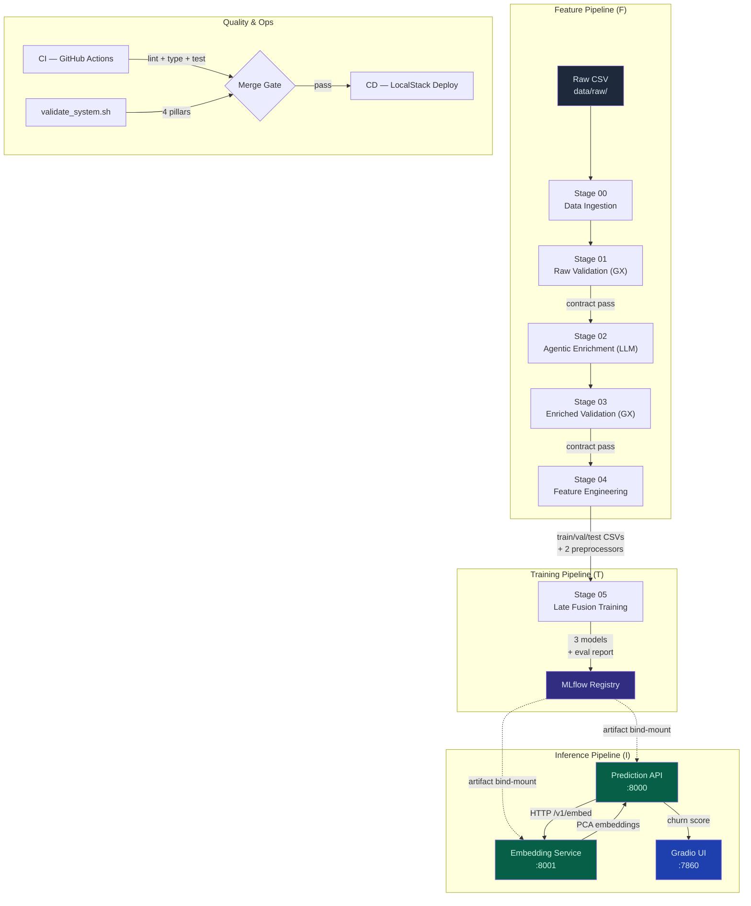
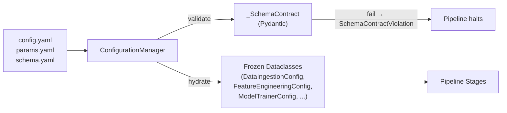
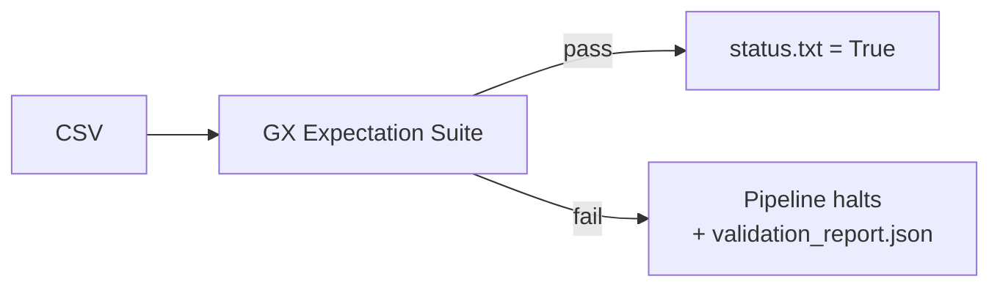
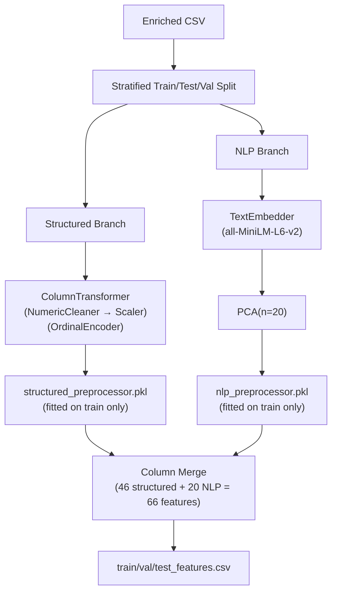
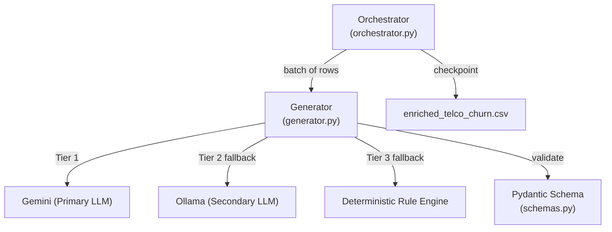
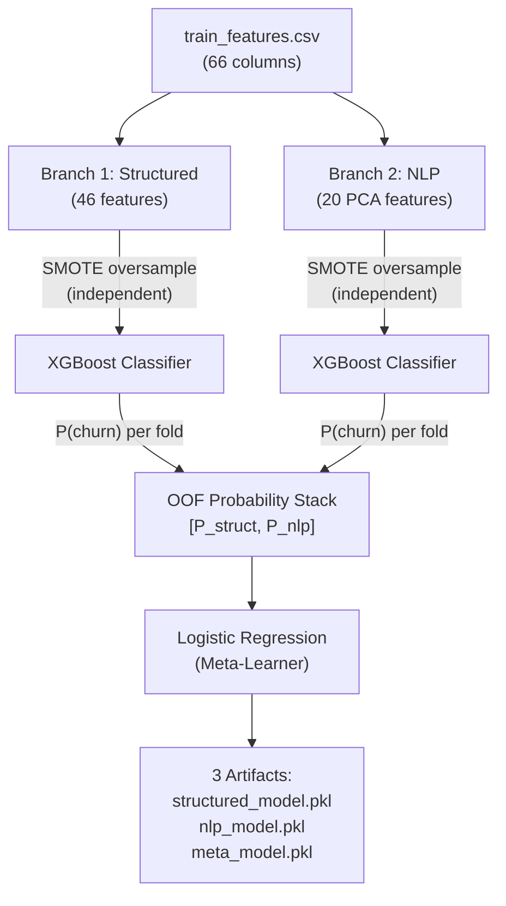
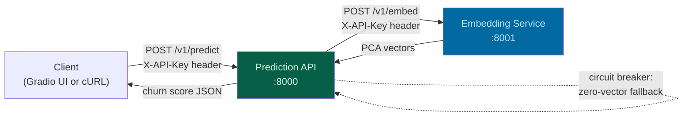
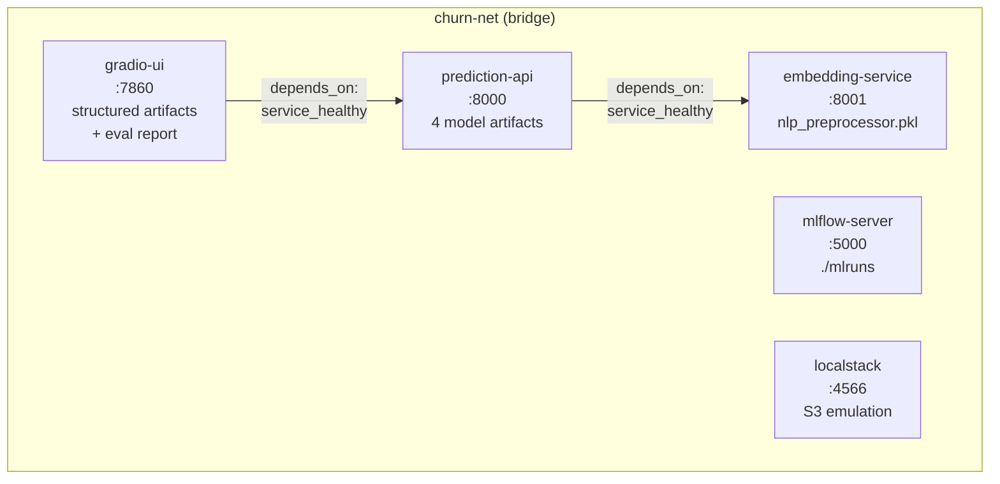

# 🏗️ Systems-Thinking Architecture Walkthrough

> **Purpose**: This document maps the *entire* system as an engineer would explain it to a senior architect — not file-by-file, but **layer-by-layer**, explaining the *why* behind every design decision and how each building block connects to form a production-ready MLOps solution.

---

## System-Level Data Flow



---

## Layer 1 — The Configuration Spine

> **Why it exists**: A single source of truth eliminates hardcoded paths, prevents config drift between pipelines, and enforces immutability via frozen dataclasses.

### Building Blocks

| File | Role | Key Mechanism |
|---|---|---|
| [config.yaml](file:///c:/Users/sebas/Desktop/ai-ml-telecom-customer-churn/config/config.yaml) | Declares *where* artifacts live | Paths only — no logic, no hyperparameters |
| [params.yaml](file:///c:/Users/sebas/Desktop/ai-ml-telecom-customer-churn/config/params.yaml) | Declares *how* the pipeline behaves | Hyperparameters: PCA dims, learning rate, model name |
| [schema.yaml](file:///c:/Users/sebas/Desktop/ai-ml-telecom-customer-churn/config/schema.yaml) | Declares *what* the data looks like | Column names, types, target column — the data contract |
| [constants/\_\_init\_\_.py](file:///c:/Users/sebas/Desktop/ai-ml-telecom-customer-churn/src/constants/__init__.py) | Maps YAML keys to Python Paths | Auto-creates directories on import; no YAML reads downstream |
| [config_entity.py](file:///c:/Users/sebas/Desktop/ai-ml-telecom-customer-churn/src/entity/config_entity.py) | Frozen `@dataclass` entities | Immutable after construction — pipeline stages cannot mutate config |
| [configuration.py](file:///c:/Users/sebas/Desktop/ai-ml-telecom-customer-churn/src/config/configuration.py) | Central hydrator + validator | `_SchemaContract` (Pydantic) validates schema.yaml at load time |

### How They Work Together



### Why This Matters (Design Decisions)

1. **Separation of Structure vs. Behavior**: `config.yaml` (where) is separated from `params.yaml` (how). Changing a hyperparameter never changes a file path, and vice versa.
2. **Fail-Fast Schema Validation**: `_SchemaContract` uses Pydantic to validate `schema.yaml` at `ConfigurationManager.__init__()` time — not at Stage 04 or 05. A missing column in schema.yaml fails *immediately*, not after 30 minutes of pipeline execution.
3. **Frozen Dataclasses**: Once `ConfigurationManager` creates a `ModelTrainerConfig`, no stage can accidentally modify it. This prevents temporal coupling bugs where Stage 04 mutates a path that Stage 05 depends on.
4. **Constants Auto-Create**: When `src.constants` is imported, `os.makedirs(exist_ok=True)` runs on all artifact directories. This means a fresh clone with zero artifacts can start any pipeline stage without a `FileNotFoundError`.

---

## Layer 2 — Feature Pipeline (The "F" in FTI)

> **Why it exists**: Raw data is never trustworthy. The Feature Pipeline transforms raw data into validated, versioned, ML-ready feature matrices while maintaining a provenance chain.

### Stage 00: Data Ingestion

**File**: [data_ingestion.py](file:///c:/Users/sebas/Desktop/ai-ml-telecom-customer-churn/src/components/data_ingestion.py)

| Concern | Implementation |
|---|---|
| **Source flexibility** | Supports HTTP download or local file copy — same interface |
| **Zip handling** | Auto-extracts `.zip` archives after download |
| **Artifact output** | `artifacts/data_ingestion/WA_Fn-UseC_-Telco-Customer-Churn.csv` |

**Why not just read from `data/raw/` directly?** Decoupling. The training pipeline should never depend on the raw source location. Data ingestion copies to `artifacts/`, and all downstream stages read from there — this enables swapping the source (S3, API, database) without touching any pipeline code.

### Stage 01 & 03: Data Validation (Great Expectations)

**File**: [data_validation.py](file:///c:/Users/sebas/Desktop/ai-ml-telecom-customer-churn/src/components/data_validation.py)



The same `DataValidation` component is used **twice** with different configs:
- **Stage 01**: Validates raw data (19 original columns)
- **Stage 03**: Validates enriched data (19 + `ticket_note` + `primary_sentiment_tag`)

**Key Design**: The validation component doesn't know what data it's validating. It reads the column list from `schema.yaml` via `ConfigurationManager`, which provides `COLUMNS` for Stage 01 and `ENRICHED_COLUMNS` for Stage 03. This is the **Strategy Pattern** — same executor, different configuration.

**Why Two Validation Gates?** Because the enrichment stage (Stage 02) uses an LLM, which is probabilistic. Stage 03 ensures the LLM didn't produce rows with missing `ticket_note` values, corrupt data types, or other contract violations. Without Stage 03, hallucinated data would silently poison feature engineering.

### Stage 04: Feature Engineering (The Mechanic)

**File**: [feature_engineering.py](file:///c:/Users/sebas/Desktop/ai-ml-telecom-customer-churn/src/components/feature_engineering.py) + [feature_utils.py](file:///c:/Users/sebas/Desktop/ai-ml-telecom-customer-churn/src/utils/feature_utils.py)

This is the most architecturally significant stage. It produces **five artifacts**:

| Artifact | Purpose |
|---|---|
| `structured_preprocessor.pkl` | Fitted ColumnTransformer for 19 tabular features |
| `nlp_preprocessor.pkl` | Fitted TextEmbedder → PCA pipeline for ticket notes |
| `train_features.csv` | Transformed training set (structured + NLP merged) |
| `val_features.csv` | Transformed validation set |
| `test_features.csv` | Transformed test set |

#### The Anti-Skew Mandate

> [!IMPORTANT]
> This is the single most critical design decision in the entire system. The preprocessors are split into two independently serialized artifacts specifically so that:
>
> 1. The **Prediction API** loads only `structured_preprocessor.pkl` — it never touches `nlp_preprocessor.pkl`
> 2. The **Embedding Service** loads only `nlp_preprocessor.pkl` — it never touches `structured_preprocessor.pkl`
>
> This eliminates training-serving skew by making it **physically impossible** for an inference service to apply the wrong transformation.



#### Custom Transformers (feature_utils.py)

- **`NumericCleaner`**: Handles `TotalCharges` blank strings (tenure=0 customers). Coerces to `NaN`, then downstream imputation fills them. *Why a custom transformer?* Because `pd.to_numeric` with `errors='coerce'` isn't a sklearn transformer — it can't be serialized inside a Pipeline.

- **`TextEmbedder`**: Wraps `SentenceTransformer` as a sklearn transformer. Uses **lazy loading** with `__getstate__`/`__setstate__` to ensure `joblib.dump` doesn't try to serialize the PyTorch model — it re-downloads on deserialization. *Why not embed at request time?* Because the fitted PCA dimensionality reduction must be applied identically in training and inference — embedding + PCA is one atomic pipeline.

#### Leakage Prevention (Diagnostic Columns)

```python
DIAGNOSTIC_COLS = ["customerID", "primary_sentiment_tag", "Churn"]
```

These columns are **explicitly excluded** from feature engineering:
- `customerID` — unique identifier with no predictive signal
- `primary_sentiment_tag` — near-deterministically correlated with `Churn` (99.3% accuracy alone). Including it would make the model appear perfect while learning nothing useful.
- `Churn` — the target variable

> [!CAUTION]
> The `primary_sentiment_tag` exclusion (the "C1 Fix") is a deliberate anti-leakage measure. The LLM-generated sentiment was derived with awareness of the churn label. In production, a customer doesn't arrive with a pre-labeled sentiment — it would need to be inferred. Using it as a feature would create a target proxy that inflates metrics artificially.

---

## Layer 3 — Agentic Data Enrichment

> **Why it exists**: The raw Telco dataset has no text data. The enrichment stage uses LLMs to synthesize realistic CRM ticket notes, transforming a purely tabular problem into a **multimodal** one that tests whether NLP signals add value beyond structured features.

### Architecture



### Building Blocks

| File | Role |
|---|---|
| [orchestrator.py](file:///c:/Users/sebas/Desktop/ai-ml-telecom-customer-churn/src/components/data_enrichment/orchestrator.py) | Batch processing with resume/checkpoint logic |
| [generator.py](file:///c:/Users/sebas/Desktop/ai-ml-telecom-customer-churn/src/components/data_enrichment/generator.py) | 3-tier LLM fallback with structured output validation |
| [schemas.py](file:///c:/Users/sebas/Desktop/ai-ml-telecom-customer-churn/src/components/data_enrichment/schemas.py) | Pydantic contracts: `CustomerInputContext` → `SyntheticCRMOutput` |
| [prompts.py](file:///c:/Users/sebas/Desktop/ai-ml-telecom-customer-churn/src/components/data_enrichment/prompts.py) | Versioned system prompt (no naked prompts — Rule 1.5) |

### Key Design Decisions

1. **3-Tier Fallback** (Brain vs. Brawn separation)
   - **Tier 1** (Gemini): Probabilistic LLM generates rich, varied text
   - **Tier 2** (Ollama): Local LLM backup if API is unavailable
   - **Tier 3** (Deterministic): Rule-based template engine — *always succeeds*. This guarantees the pipeline never halts because an LLM is down.

2. **Leakage-Free Prompts** (C1 Fix): The `CustomerInputContext` schema **excludes the `Churn` label**. The LLM sees tenure, contract type, billing details — observable signals a CRM agent would have — but never whether the customer actually churned. This ensures the synthetic text captures *service friction signals*, not target label echoes.

3. **Resume/Checkpoint**: The orchestrator saves intermediate results every N rows. If the pipeline crashes at row 4,000 (e.g., API rate limit), restarting picks up from row 4,001 instead of re-processing everything.

4. **Pydantic Output Validation**: Every LLM response is parsed through `SyntheticCRMOutput`. If the LLM returns malformed JSON or missing fields, the response is rejected and the next fallback tier is tried.

---

## Layer 4 — Training Pipeline (The "T" in FTI)

> **Why it exists**: Converts feature matrices into serialized model artifacts while tracking every experiment for reproducibility.

### Late Fusion Architecture



### Building Blocks

| File | Role |
|---|---|
| [trainer.py](file:///c:/Users/sebas/Desktop/ai-ml-telecom-customer-churn/src/components/model_training/trainer.py) | 3-stage stacking: base models → OOF → meta-learner |
| [evaluator.py](file:///c:/Users/sebas/Desktop/ai-ml-telecom-customer-churn/src/components/model_training/evaluator.py) | Logs metrics + artifacts to MLflow; produces `evaluation_report.json` |
| [mlflow_config.py](file:///c:/Users/sebas/Desktop/ai-ml-telecom-customer-churn/src/utils/mlflow_config.py) | Environment-aware URI resolution (local / staging / production) |

### Critical Design Decisions

1. **Independent SMOTE Per Branch** (Decision B1): Class imbalance is 2.77:1. SMOTE is applied *independently* within each branch after feature extraction. Why? Because SMOTE generates synthetic neighbours in feature space — mixing 46 structured dimensions with 20 NLP dimensions produces geometrically meaningless synthetic points.

2. **Out-of-Fold (OOF) Stacking**: The meta-learner is trained on **OOF predictions**, not on the same training set the base models saw. Without OOF, the base models would predict nearly perfectly on their own training data, and the meta-learner would learn to trust those inflated probabilities — a form of **meta-leakage**.

   ```
   For each fold k in StratifiedKFold(5):
       Train XGB on folds != k
       Predict on fold k → store as OOF_struct[k], OOF_nlp[k]
   
   Stack: X_meta = [OOF_struct, OOF_nlp]  (shape: n_train × 2)
   Train: LogisticRegression on X_meta
   ```

3. **MLflow Experiment Tracking**: Every training run logs:
   - Hyperparameters (learning rate, n_estimators, PCA components)
   - Metrics (Recall, Precision, F1, ROC-AUC, PR-AUC)
   - Artifacts (confusion matrices, ROC curves)
   - Git commit hash + DVC data hash for full reproducibility
   
   The `mlflow_config.py` resolves tracking URIs at runtime — locally it's `./mlruns`, inside Docker it's `http://mlflow-server:5000`.

---

## Layer 5 — Inference Pipeline (The "I" in FTI)

> **Why it exists**: The model is only valuable when it serves real-time predictions. The inference layer decomposes into two independently deployable microservices connected by a circuit breaker.

### Microservice Architecture



### Prediction API (Port 8000)

| File | Role |
|---|---|
| [main.py](file:///c:/Users/sebas/Desktop/ai-ml-telecom-customer-churn/src/api/prediction_service/main.py) | Application factory + lifespan (artifact loading) |
| [inference.py](file:///c:/Users/sebas/Desktop/ai-ml-telecom-customer-churn/src/api/prediction_service/inference.py) | `InferenceService` — owns **all** transformation logic |
| [router.py](file:///c:/Users/sebas/Desktop/ai-ml-telecom-customer-churn/src/api/prediction_service/router.py) | Pure HTTP conductor — zero business logic |
| [schemas.py](file:///c:/Users/sebas/Desktop/ai-ml-telecom-customer-churn/src/api/prediction_service/schemas.py) | Pydantic I/O contracts |

**Startup Lifecycle**:
1. `lifespan()` calls `ConfigurationManager` to resolve artifact paths
2. `joblib.load()` deserializes all 4 artifacts (structured_preprocessor, structured_model, nlp_model, meta_model)
3. `InferenceService` is instantiated with all artifacts + embedding URL
4. Stored on `app.state` — zero-cost per-request access
5. API key loaded from config and attached to `app.state` for validation

**Request Flow (POST /v1/predict)**:
```
1. Pydantic validates CustomerFeatureRequest (19 fields + ticket_note)
2. X-API-Key header validated via Depends(validate_api_key)
3. Router calls InferenceService.predict_batch([single_customer])
4. InferenceService:
   a. Builds DataFrame from raw fields (STRUCTURED_RAW_COLS order)
   b. structured_preprocessor.transform() → 46-dim array
   c. HTTP POST to embedding-service /v1/embed → 20-dim PCA vector
   d. Branch 1: structured_model.predict_proba() → P_struct
   e. Branch 2: nlp_model.predict_proba() → P_nlp
   f. Stack [P_struct, P_nlp] → meta_model.predict_proba() → final score
5. Router returns ChurnPredictionResponse
```

#### The Circuit Breaker Pattern

> [!IMPORTANT]
> If the Embedding Service is unreachable, the Prediction API **does not fail**. It:
> - Logs a `WARNING` with the exact error type
> - Falls back to a zero-vector of shape `(n, pca_components)`
> - Sets `nlp_branch_available=False` in the response
> - Continues with Branch 1 structured prediction uninterrupted
>
> This means the Prediction API's availability is **completely decoupled** from the Embedding Service's availability.

```python
# Circuit breaker in inference.py
except httpx.TimeoutException:
    logger.warning(f"Embedding service timed out...")
except httpx.HTTPStatusError:
    logger.warning(f"Embedding service returned HTTP {exc.response.status_code}...")
except httpx.RequestError:
    logger.warning(f"Embedding service unreachable...")

# Fallback: zero-vector
return np.zeros((n, self.pca_components), dtype=np.float32), False
```

### Embedding Service (Port 8001)

| File | Role |
|---|---|
| [main.py](file:///c:/Users/sebas/Desktop/ai-ml-telecom-customer-churn/src/api/embedding_service/main.py) | Application factory + lifespan (preprocessor loading + warmup) |
| [router.py](file:///c:/Users/sebas/Desktop/ai-ml-telecom-customer-churn/src/api/embedding_service/router.py) | Pure HTTP conductor |
| [schemas.py](file:///c:/Users/sebas/Desktop/ai-ml-telecom-customer-churn/src/api/embedding_service/schemas.py) | `EmbedRequest` / `EmbedResponse` contracts |

**Why a separate service?** Three reasons:
1. **Memory isolation**: SentenceTransformer loads ~90MB of PyTorch weights. If it crashes, only the embedding service restarts — the prediction API continues serving structured-only predictions.
2. **Independent scaling**: In production, embedding is GPU-intensive. You can scale embedding replicas independently of prediction replicas.
3. **Anti-Skew Mandate**: By loading only `nlp_preprocessor.pkl`, this service *cannot accidentally* apply structured preprocessing to text data.

**Cold-Start Warmup**: The lifespan runs a dummy `transform(DataFrame({"ticket_note": ["warmup"]}))` at startup. This forces PyTorch model initialisation (~2s) to happen *before* any client traffic. Without this, the first real request would breach the prediction API's 5-second httpx timeout.

### API Security

Both services implement `X-API-Key` header authentication:
```python
async def validate_api_key(request: Request, x_api_key: str = Header(...)):
    if x_api_key != request.app.state.api_key:
        raise HTTPException(status_code=401, detail="Invalid API Key")
```

The API key is injected via `.env` → `ConfigurationManager` → `app.state`. All routes are protected via `Depends(validate_api_key)`.

---

## Layer 6 — Observability, UI & Explainability

### Gradio Dashboard

**File**: [app.py](file:///c:/Users/sebas/Desktop/ai-ml-telecom-customer-churn/src/ui/app.py)

The UI is a 3-tab Gradio Blocks application:

| Tab | File | Purpose |
|---|---|---|
| Single Prediction | [single_predict.py](file:///c:/Users/sebas/Desktop/ai-ml-telecom-customer-churn/src/ui/pages/single_predict.py) | Manual customer input → prediction + SHAP waterfall |
| Batch Prediction | `batch_predict.py` | CSV upload → bulk scoring |
| Experiment Tracking | [run_comparison.py](file:///c:/Users/sebas/Desktop/ai-ml-telecom-customer-churn/src/ui/pages/run_comparison.py) | Reads `evaluation_report.json` → champion vs challenger table |

**Key Design**: The UI is a **pure consumer**. It never touches model artifacts directly for prediction — it calls the Prediction API via [api_client.py](file:///c:/Users/sebas/Desktop/ai-ml-telecom-customer-churn/src/ui/data_loaders/api_client.py). The only local artifact access is for SHAP explanations, which are computed client-side using the structured branch model.

### SHAP Component

**File**: [shap_chart.py](file:///c:/Users/sebas/Desktop/ai-ml-telecom-customer-churn/src/ui/components/shap_chart.py)

Loads `structured_preprocessor.pkl` and `structured_model.pkl` **lazily** (module-level globals, loaded on first call). Generates per-customer SHAP waterfall plots using `TreeExplainer` on the XGBoost structured model. This runs locally in the Gradio container, not via the API — SHAP computation is synchronous and compute-heavy, not suitable for an API request flow.

### Logging Architecture

**File**: [logger.py](file:///c:/Users/sebas/Desktop/ai-ml-telecom-customer-churn/src/utils/logger.py)

All modules use `get_logger(__name__)` which configures:
- **File handler**: Rotating file (`logs/running_logs.log`)
- **Console handler**: `RichHandler` for structured terminal output
- **Visual separators**: `headline` parameter adds `═══` separators for stage boundaries

### Utilities & Error Handling

| File | Role |
|---|---|
| [common.py](file:///c:/Users/sebas/Desktop/ai-ml-telecom-customer-churn/src/utils/common.py) | YAML/JSON read/write + `create_directories()` |
| [exceptions.py](file:///c:/Users/sebas/Desktop/ai-ml-telecom-customer-churn/src/utils/exceptions.py) | Typed domain exceptions (`SchemaContractViolation`, `StatisticalContractViolation`) with structured context |
| [array_utils.py](file:///c:/Users/sebas/Desktop/ai-ml-telecom-customer-churn/src/utils/array_utils.py) | `ensure_ndarray()` — handles DataFrame/Series/ndarray outputs consistently |

**Why typed exceptions?** Because agents (and humans) need to *understand* failures, not just see tracebacks. A `SchemaContractViolation` carries structured context (which columns failed, expected vs. actual) that an agentic healing system could parse and act on.

---

## Layer 7 — Containerization & Networking

> **Why it exists**: Containers ensure environment parity between development, CI, and production. The networking layer enforces service isolation and deterministic startup ordering.

### Docker Architecture



### Multi-Stage Dockerfiles

All services use the same pattern:

```
Stage 1 (builder):
  - python:3.11-slim base
  - Install uv → create venv → pip install dependencies
  - [Embedding only: bake SentenceTransformer model into image]

Stage 2 (runtime):
  - Clean python:3.11-slim (no build tools)
  - Create non-root appuser:appgroup
  - Copy venv + app source + config
  - HEALTHCHECK using httpx (no curl in slim images)
  - entrypoint.sh → CMD uvicorn
```

### Key Design Decisions

| Decision | Rationale |
|---|---|
| **Bind-mount artifacts, don't COPY** | Image stays lean (~200MB). Artifacts can change without rebuilding. `docker-compose.yaml` mounts `./artifacts/...` as `:ro` |
| **Bake SentenceTransformer (embedding only)** | The model is 90MB and immutable. Baking it into the image eliminates download latency and makes the container fully offline-capable |
| **Non-root appuser** | Least-privilege execution. Pre-create all write directories (`logs/`, `artifacts/`) before `USER appuser` |
| **healthcheck via httpx** | `python:3.11-slim` has no `curl`. Using Python httpx ensures the health check uses the same dependency stack |
| **start_period: 60s (embedding)** | SentenceTransformer warmup takes ~13s. Health checks during this window are not counted as failures. Without this, Docker would restart the container during warmup |

### entrypoint.sh — S3 Artifact Fetch

**File**: [entrypoint.sh](file:///c:/Users/sebas/Desktop/ai-ml-telecom-customer-churn/docker/entrypoint.sh)

```bash
if [ -n "$ARTIFACTS_S3_BUCKET" ] && [ "$ENV" != "local" ]; then
    aws s3 sync s3://${ARTIFACTS_S3_BUCKET}/artifacts/ /app/artifacts/
fi
exec "$@"  # Pass control to CMD (uvicorn)
```

In local development, `ENV=local` and artifacts are bind-mounted. In cloud deployment (ECS), the entrypoint fetches artifacts from S3 before starting the application. This decouples the container image from the artifact lifecycle — you can retrain and update artifacts without rebuilding images.

### Network Topology

All services communicate on `churn-net` (bridge driver). Service DNS resolution uses container names (e.g., `http://embedding-service:8001`). The `EMBEDDING_SERVICE_HOST` environment variable overrides the config.yaml default of `127.0.0.1` to the Docker DNS name.

---

## Layer 8 — CI/CD & Quality Gates

### CI: Continuous Integration

**File**: [ci.yml](file:///c:/Users/sebas/Desktop/ai-ml-telecom-customer-churn/.github/workflows/ci.yml)

Triggers on **every push** and **every PR targeting main**. Blocks merge if any pillar fails.

```
Pillar 1a — ruff check (linting)
Pillar 1b — ruff format --check (formatting)
Pillar 1c — pyright (type checking, blocking)
Pillar 2  — pytest with 65% coverage gate
```

**Why pyright is blocking**: The project uses strict typing for all Pydantic models, tool schemas, and API contracts. A type error in a `BaseModel` could cause a runtime 422 that passes all unit tests but fails in production.

### CD: Continuous Deployment (LocalStack Simulation)

**File**: [cd.yml](file:///c:/Users/sebas/Desktop/ai-ml-telecom-customer-churn/.github/workflows/cd.yml)

Triggers on **push to main** only (post-merge). Simulates a full AWS deployment:

```
1. Start LocalStack container
2. Create S3 bucket (telecom-churn-artifacts-local)
3. Sync artifacts to S3
4. Build Docker images (3 services)
5. Push to local registry (simulating ECR)
6. Register ECS task definitions (simulated)
7. Deploy to Fargate (simulated)
```

**Why LocalStack instead of real AWS?** This is a portfolio project. The CD workflow proves the *infrastructure-as-code intent* without incurring AWS costs. The exact same steps work against real AWS by changing environment variables.

### Multi-Point Validation Gate

**File**: [validate_system.sh](file:///c:/Users/sebas/Desktop/ai-ml-telecom-customer-churn/validate_system.sh)

A pre-deployment check that mirrors CI pillars locally:

| Pillar | Gate | Blocking? |
|---|---|---|
| 1. Static Code Quality | ruff + pyright | **Yes** |
| 2. Logic & Coverage | pytest ≥ 65% | **Yes** |
| 3. Pipeline Sync | `dvc status` up to date | **Yes** |
| 4. Service Health | HTTP 200 on :8000, :8001, :7860 | **Warning only** |

Pillar 4 is non-blocking because services may not be running in a pure CI environment. This is by design — static quality and test coverage are enforced everywhere, while service health is verified only when services are deployed.

### DVC: Pipeline Versioning

**File**: [dvc.yaml](file:///c:/Users/sebas/Desktop/ai-ml-telecom-customer-churn/dvc.yaml)

DVC declares the full pipeline DAG:

```
data_ingestion → validate_raw → enrich_data → validate_enriched → feature_engineering → train_model
```

Each stage declares:
- **cmd**: The exact Python command to run
- **deps**: Input files + source code (change triggers re-execution)
- **outs**: Output artifacts (cached by DVC)

The `persist: true` flag on `enriched_telco_churn.csv` prevents DVC from deleting it on re-run — critical because LLM enrichment is non-deterministic and expensive.

---

## Failure Cascade Matrix

This table shows what happens when each component fails, and how the system degrades gracefully:

| Failure Point | Impact | Mitigation | User-Visible Effect |
|---|---|---|---|
| **schema.yaml missing column** | Pipeline halts at `ConfigurationManager.__init__()` | `_SchemaContract` Pydantic validation | Error message identifying exact missing field |
| **GX validation fails** | Pipeline halts at Stage 01/03 | `validation_report.json` explains which expectations failed | Pipeline doesn't proceed; data quality issue logged |
| **LLM unavailable (all tiers)** | Enrichment uses Tier 3 deterministic fallback | Rule-based template engine generates synthetic text | Notes are formulaic but structurally valid |
| **Embedding Service down** | Prediction API uses zero-vector fallback | Circuit breaker in `InferenceService._get_embeddings()` | `nlp_branch_available=False` in response; structured-only prediction |
| **Embedding Service slow (>5s)** | Same as above | `httpx.Timeout(5.0)` triggers fallback | Same graceful degradation |
| **Model artifacts missing** | FastAPI startup fails in lifespan | `joblib.load()` raises `FileNotFoundError` | Service doesn't start; health check fails; Compose reports unhealthy |
| **DVC pipeline out of sync** | `validate_system.sh` Pillar 3 fails | `dvc status` reports stale artifacts | Deployment blocked until `dvc repro` runs |
| **Type error in Pydantic model** | CI Pillar 1c (pyright) fails | Blocking type check in CI | PR cannot merge |

---

## Glossary of Design Decisions

These decision codes are referenced throughout the codebase in comments:

| Code | Decision | Location |
|---|---|---|
| **A2** | Sentiment Tag excluded from training (anti-leakage) | `feature_engineering.py` (`DIAGNOSTIC_COLS`) |
| **B1** | SMOTE applied independently per branch | `trainer.py` |
| **C1** | Churn label excluded from LLM enrichment prompts | `schemas.py` (`CustomerInputContext`) |
| **D2** | Router is pure conductor; all logic in `InferenceService` | `router.py` / `inference.py` |
| **E1** | SentenceTransformer baked into Docker image | `embedding_service/Dockerfile` |
| **F1** | Artifacts bind-mounted, not copied into images | `docker-compose.yaml` volumes |
| **G1** | MLflow file store (bind-mount ./mlruns) | `docker-compose.yaml` mlflow-server |
| **K2** | CD deploys 3 services to LocalStack | `cd.yml` |
| **L1** | S3 artifact sync via entrypoint.sh | `docker/entrypoint.sh` |
| **M1** | Simulated ECS Fargate deployment | `cd.yml` |
| **R1** | Pre-create directories for non-root user | All Dockerfiles |

---

## How to Explain This System

When asked "walk me through this system", the narrative should flow through **three arcs**:

### Arc 1: Data Trust (Layers 1-3)
> "Before a single model trains, the system validates raw data against schema contracts using Great Expectations, enriches it with LLM-generated CRM notes (with a 3-tier fallback), and re-validates. The enrichment stage explicitly prevents leakage by excluding the target label from LLM prompts."

### Arc 2: Model Integrity (Layer 4)
> "The training pipeline implements Late Fusion stacking — two XGBoost base models (structured and NLP branches) feed into a Logistic Regression meta-learner. SMOTE is applied independently per branch, and the meta-learner trains on out-of-fold predictions to prevent meta-leakage. Everything is tracked in MLflow."

### Arc 3: Production Resilience (Layers 5-8)
> "The inference layer decomposes into two microservices connected by a circuit breaker. If the embedding service goes down, the prediction API degrades to structured-only predictions instead of failing. Both services run as non-root users in multi-stage Docker containers, authenticated via API keys, orchestrated on an isolated bridge network with health-gated startup ordering. CI enforces linting, type checking, and test coverage; CD simulates full AWS deployment via LocalStack."

---

> [!TIP]
> **The unifying theme across all 8 layers is defensive design**: the system is built to fail gracefully at every boundary — schema validation catches bad config, GX catches bad data, circuit breakers catch bad services, and CI catches bad code. No single failure cascades into a silent production error.

---

## Key Design Decisions in the System

> These are the 10 decisions that matter most — the ones where a different choice would have fundamentally broken the system.

### D1 — Two Preprocessors, Not One

The single most impactful design decision. Splitting preprocessing into `structured_preprocessor.pkl` and `nlp_preprocessor.pkl` is what makes the circuit breaker possible. If there were one monolithic preprocessor, you couldn't deploy the embedding service independently, couldn't fall back gracefully, and couldn't scale the NLP branch separately. **This one decision unlocks the entire microservice architecture.**

### D2 — Router as a Pure HTTP Conductor

All inference logic lives in `InferenceService`, not in the router. The router is 5 lines per endpoint: validate, call service, return. This means you can unit-test `InferenceService` in isolation, swap the HTTP framework without touching business logic, and trace any inference bug to one module. **Separation of concerns applied to API design.**

### D3 — OOF Stacking for the Meta-Learner

Without out-of-fold predictions, the meta-learner trains on inflated base model outputs (the base models have memorized their own training data). OOF forces the meta-learner to learn from what the base models produce on *unseen* data — the same distribution it will face at test time. **This is the difference between a stacked model that overfits and one that generalises.**

### D4 — Fail-Fast at ConfigurationManager Init

`_SchemaContract` validates at construction time, not at the first data read. This means a typo in `schema.yaml` fails in 0.1 seconds, not after 30 minutes of pipeline execution. **Defensive initialization — all configuration errors surface before any work begins.**

### D5 — SMOTE Applied Independently Per Branch

SMOTE generates synthetic samples by interpolating between nearest neighbours in feature space. Applying it to a merged 66-dimensional space (46 structured + 20 NLP) creates synthetic points that span incompatible geometric spaces — a structured feature like `Contract` being interpolated with a PCA embedding component is mathematically meaningless. Independent application respects each branch's own geometry.

### D6 — Leakage-Free LLM Prompts (C1 Fix)

The `CustomerInputContext` Pydantic schema explicitly excludes the `Churn` column before passing data to the LLM. This is not obvious code — it's a deliberate architectural constraint. The LLM prompt is designed to simulate what a CRM agent *would have written* based on observable signals. Feeding it the outcome would create a target proxy that destroys the experiment's scientific validity.

### D7 — Bake the SentenceTransformer into the Docker Image

The embedding service's Dockerfile runs `SentenceTransformer('all-MiniLM-L6-v2')` during `docker build`, caching the 90MB model inside the image. At startup, the model is already on disk — no download, no cold-start latency, no internet dependency. Combined with the lifespan warmup, the embedding service is fully request-ready within the `start_period: 60s` health-check window.

### D8 — Artifacts Bind-Mounted, Not Baked

Model artifacts are mounted at runtime (`./artifacts:/app/artifacts:ro`), not copied into the image. The consequence: retraining produces new `.pkl` files, and the container picks them up on next restart without a rebuild. Image size stays lean (~200MB vs. potentially 1GB+ with models baked in). **Decouples the training lifecycle from the deployment lifecycle.**

### D9 — DVC `persist: true` on the Enriched CSV

LLM enrichment is non-deterministic (outputs vary per call) and expensive (7,000+ API calls). Without `persist: true`, DVC would delete the enriched CSV on `dvc repro` and force re-running billions of tokens worth of LLM calls. This flag preserves the artifact across runs while still tracking whether upstream deps have changed.

### D10 — Pyright as a Blocking CI Gate

Type errors in Pydantic `BaseModel` fields (e.g., a `str` field annotated as `int`) don't raise at class definition — they raise at validation time with a runtime 422. Pyright catches this before the code ever runs. Given every API endpoint, tool schema, and data contract in this system uses Pydantic, a permissive type checking policy would allow entire categories of runtime failures that unit tests wouldn't catch.

---

## Key Engineering/Architectural Tradeoffs in the System

> Every architecture is a set of tradeoffs. Understanding *what was traded away* demonstrates deeper mastery than knowing what was chosen.

### Tradeoff 1 — Two Microservices vs. One Monolith

| Chosen | Traded Away |
|---|---|
| Independent deployability, circuit breaker, memory isolation | Operational complexity (two processes to manage, two health checks, inter-service latency) |

**The reasoning**: The embedding service uses a 90MB PyTorch model that creates a specific failure mode (OOM crashes, slow restarts). Isolating it means that failure class affects only that service — the prediction API continues operating with structured features. The inter-service latency (~5ms local, ~20ms cross-AZ) is acceptable because it's bounded by `httpx.Timeout(5.0)` and the circuit breaker absorbs it.

### Tradeoff 2 — OOF Stacking vs. Hold-Out Stacking

| Chosen | Traded Away |
|---|---|
| All training data used for base model training (5-fold cross-validation) | Training time (5× the base model training cost) |

**The reasoning**: Hold-out stacking (train bases on 70%, stack on 15%) wastes data. With ~7,000 samples and a 26.5% minority class, losing 15% of training data measurably reduces base model quality. OOF preserves all data for training while still producing unbiased meta-features.

### Tradeoff 3 — Bind-Mount Artifacts vs. S3 Pull at Runtime

| Chosen (local) | Chosen (cloud) | Traded Away |
|---|---|---|
| Bind mounts for development | `entrypoint.sh` S3 sync for ECS | A unified artifact delivery mechanism |

**The reasoning**: Bind mounts are instant and zero-cost for local development but don't exist in cloud environments where ECS tasks start on fresh EC2 instances. The `entrypoint.sh` conditional (`if ENV != "local"`) bridges both worlds without duplicating Docker images. The tradeoff is additional startup latency (~10-30s S3 sync) in cloud deployments.

### Tradeoff 4 — Frozen Dataclasses vs. Mutable Config Dicts

| Chosen | Traded Away |
|---|---|
| Immutable configs caught at construction time | Runtime flexibility to modify config mid-pipeline |

**The reasoning**: No legitimate pipeline stage should need to modify its configuration after construction. The frozen `@dataclass` makes that contract explicit and enforced by the Python runtime. The cost is that testing requires constructing complete dataclass instances — solved by the centralized `conftest.py` fixtures.

### Tradeoff 5 — LocalStack simulation vs. Real AWS in CD

| Chosen | Traded Away |
|---|---|
| Zero AWS cost, validates infrastructure-as-code intent | ECS Pro features unavailable (simulated with echo), no real network routing tested |

**The reasoning**: A portfolio project demonstrating production MLOps patterns shouldn't incur ~$200/month in ECS costs just to run CI/CD. LocalStack validates that task definitions are correctly structured, S3 syncs work, and the full deployment DAG is correct — the parts that are usually broken. The actual Fargate launch and ALB routing are environment-specific and are the only things not exercised.

### Tradeoff 6 — PCA(n=20) Dimensionality Reduction vs. Full Embeddings

| Chosen | Traded Away |
|---|---|
| 20-dimensional vectors, fast inference, low memory | Full 384-dimensional `all-MiniLM-L6-v2` embeddings, potentially higher NLP branch accuracy |

**The reasoning**: The meta-learner only sees 2 scalars: `[P_struct, P_nlp]`. The NLP branch is one XGBoost model consuming the PCA output. With 7,000 training samples, a 384-dimensional feature space on the NLP branch would cause severe overfitting. PCA(n=20) captures the majority of semantic variance while staying well within the n_samples >> n_features requirement for XGBoost without regularization overhead dominating computation.

### Tradeoff 7 — Deterministic Fallback in Enrichment vs. Halting Pipeline

| Chosen | Traded Away |
|---|---|
| Pipeline always completes; formulaic notes for failed rows | Every enriched row guaranteed to be LLM-quality text |

**The reasoning**: Halting enrichment at row 4,000 because of an API rate limit is unacceptable for a production pipeline. A formulaic note ("Customer with 72 months tenure has expressed billing concerns") is worse than an LLM note but far better than a missing value or a pipeline crash. The downstream NLP model is trained on a mix of LLM-generated and deterministic notes, which actually improves robustness by including formulaic text in the training distribution.

---

## What Separates "I Built It" from "I Understand Why It Works"

> This is the section that determines whether you're a senior engineer or a junior who followed a tutorial. The questions below probe *why* — the reasoning behind every decision, not the mechanics of how it's coded.

### Level 1 — You Built It (Can describe what the code does)
- "The enrichment stage uses Gemini to generate ticket notes."
- "The prediction API loads four `.pkl` files at startup."
- "SMOTE is used to handle class imbalance."

### Level 2 — You Understand It (Can explain why each decision was made)
- "Gemini is Tier 1, but there's a 3-tier fallback specifically because LLM APIs are unreliable in batch processing — a deterministic fallback guarantees the pipeline completes."
- "All four artifacts are loaded in `lifespan()`, not per-request, because joblib deserialization is expensive. Loading once at startup and caching on `app.state` makes the per-request cost ~0."
- "SMOTE is applied *per branch* because SMOTE interpolates in feature space. A unified 66-dimensional space mixes geometrically incompatible structured and NLP features."

### Level 3 — You Own It (Can reason about failure modes, alternatives, and evolution)
- "If we retrain the NLP branch with a different PCA dimensionality (n=30 instead of n=20), we'd need to redeploy the embedding service — which is why the `pca_components` config lives in `params.yaml` and is passed to `InferenceService` at startup. The zero-vector fallback dimension is runtime-configured, not hardcoded."
- "The `primary_sentiment_tag` isn't in `DIAGNOSTIC_COLS` by accident. Its 99.3% correlation with `Churn` means it's a target proxy — including it would make the model appear production-ready while actually being a leakage artifact."
- "The `entrypoint.sh` S3 sync uses `--exact-timestamps` instead of `--size-only` because model artifacts can be retrained to the same file size but different weights. Size-only comparison would skip the sync and serve stale models."

### The Litmus Test Questions

> If you can answer these fluently without looking at the code, you're operating at Level 3:

1. **"Why does the embedding service need a warmup call in lifespan?"**
   > TextEmbedder uses lazy loading — SentenceTransformer isn't initialized until the first `transform()` call. Initialization takes ~2s. Without warmup, the first real `/v1/embed` request takes 2s extra, breaching the prediction API's 5-second inter-service timeout.

2. **"Why not just train one XGBoost model on all 66 features?"**
   > The Late Fusion architecture tests whether NLP signals add value *beyond* structured features. A single model conflates the two branches — you can't isolate the NLP contribution in evaluation. Separate branches let you compute lift: `F1(Late Fusion) - F1(Structured Baseline)`.

3. **"Why does the router call `predict_batch([payload])` for a single-customer request?"**
   > Code reuse and consistency. The batch endpoint and single endpoint use identical inference logic — wrapping a single customer in a list lets both endpoints share one implementation. It also future-proofs the single endpoint: if you add rate limiting or async processing, `predict_batch` handles it uniformly.

4. **"What would break if you removed the `frozen=True` from the dataclasses?"**
   > Nothing immediately. But a pipeline stage could accidentally mutate a shared config object (e.g., Stage 04 modifying the `model_output_dir` path), causing Stage 05 to write artifacts to the wrong location with no error. Frozen dataclasses make mutation a hard runtime error (`FrozenInstanceError`) rather than a silent bug.

5. **"Why does `nlp_preprocessor.pkl` need the `__getstate__` / `__setstate__` protocol?"**
   > `joblib.dump` serializes the entire Python object graph. SentenceTransformer contains PyTorch tensors and CUDA state that don't serialize cleanly across environments. `__getstate__` saves only the model *name* (a string), and `__setstate__` re-downloads the model from HuggingFace on first use. This means the pkl is portable across machines even if one has CUDA and another doesn't.

---

## The Questions You Can Now Answer

> These are the questions elite employers and senior engineers ask in technical interviews. Use the system walkthrough to anchor every answer.

### Architecture & Design

**Q: "How does your system prevent data leakage?"**
> Four independent mechanisms: (1) Diagnostic columns excluded at feature engineering (`DIAGNOSTIC_COLS`), (2) Churn label stripped from LLM context (`CustomerInputContext`), (3) Preprocessors fitted only on training set — never val or test, (4) OOF stacking prevents meta-leakage between base model training and meta-learner training.

**Q: "How would you add a new feature to the model without retraining from scratch?"**
> You'd add the column to `schema.yaml`, update `NUMERIC_COLS` or `CATEGORICAL_COLS` in `feature_engineering.py`, run `dvc repro feature_engineering` to regenerate features, then `dvc repro train_model`. DVC's DAG knows which stages depend on the changed files and re-executes only what changed.

**Q: "What happens if you deploy a new model but the preprocessor is out of sync?"**
> This is training-serving skew — the most dangerous failure mode in MLOps. The system mitigates it by: (1) serializing the preprocessor alongside the model in the same training run, (2) the Makefile `artifacts-push` syncs both together to S3, (3) the entrypoint pulls both in the same `aws s3 sync`. They're versioned and deployed atomically.

### Production & Reliability

**Q: "What happens to your prediction API when the embedding service crashes?"**
> The circuit breaker in `InferenceService._get_embeddings()` catches `httpx.TimeoutException`, `httpx.HTTPStatusError`, and `httpx.RequestError`. It logs a WARNING, substitutes a zero-vector of shape `(n, pca_components)`, and sets `nlp_branch_available=False` in the response. The prediction API continues serving structured-branch predictions with no 5xx response.

**Q: "How do you ensure your Docker containers don't run as root?"**
> The multi-stage Dockerfiles create `appgroup` and `appuser` via `addgroup --system / adduser --system`. All write directories (`logs/`, `artifacts/`) are pre-created as root before `USER appuser`. The `chown -R appuser:appgroup /app` runs before the USER switch so the non-root user has write access to its working directory.

**Q: "How does your CI/CD prevent bad code from reaching production?"**
> Four blocking gates: (1) `ruff check` — import order, unused variables, anti-patterns, (2) `ruff format --check` — consistent formatting, (3) `pyright` — type errors in Pydantic models and API schemas, (4) `pytest --cov-fail-under=65` — logic correctness and 65% coverage. All four must pass before a PR can merge. The CD workflow runs only after a successful merge to main.

### ML Science

**Q: "Why did you choose Late Fusion over Early Fusion?"**
> Early Fusion (concatenating raw features before training) forces one model to learn from both structured and NLP features simultaneously. Late Fusion trains specialized models on each data type independently, then combines their probability estimates. The advantage: you can compare the isolated contribution of each branch (structured AUC vs. NLP AUC vs. fused AUC) and quantify the NLP lift. This makes the ROI of the NLP component defensible to stakeholders.

**Q: "How do you handle class imbalance in a stacked architecture?"**
> SMOTE is applied independently within each branch's training pipeline after feature extraction. Independent application respects each branch's geometric space — SMOTE interpolates nearest neighbours, and interpolation across incompatible feature spaces (structured categorical + NLP embedding) produces meaningless synthetic samples. The meta-learner trains on OOF probabilities which are already calibrated to the original class distribution.

**Q: "Why use Logistic Regression as the meta-learner instead of another XGBoost?"**
> The meta-learner inputs are only 2 features: `[P_struct, P_nlp]`. With 2 features and ~7,000 samples, Logistic Regression is the right tool — its linear decision boundary over two probability estimates is interpretable and avoids the risk of the meta-learner overfitting to noise. An XGBoost meta-learner with 2 features would be over-parameterized.

---

## Mental Model Summary

> **The entire system can be understood through one sentence**: *Validated data flows through an agentic enrichment layer into a leakage-proof training pipeline, producing three model artifacts that are served by two independently resilient microservices behind a circuit breaker, with quality enforced end-to-end by typed contracts, automated testing, and pipeline versioning.*

### The Three Invariants

Every decision in this system upholds three invariants:

1. **No silent failures** — every boundary (config load, data validation, LLM output, API response, CI gate) either passes explicitly or fails loudly with structured, actionable context.

2. **No training-serving skew** — the transformation applied in training is identical to the transformation applied in inference. This is enforced structurally via two independently serialized preprocessors — not by convention or documentation.

3. **Graceful degradation over hard failure** — when an optional component fails (LLM unavailable → rule-based fallback, embedding service down → zero-vector fallback), the system continues operating at reduced capability rather than halting completely.

### The System as a Series of Contracts

```
schema.yaml              → _SchemaContract → ConfigurationManager
                            "What data should look like"

CustomerInputContext     → LLM Prompt → SyntheticCRMOutput
                            "What data the LLM is allowed to see"

DIAGNOSTIC_COLS          → FeatureEngineering exclusion
                            "What data the model is never allowed to see"

OOF Protocol             → LateFusionTrainer
                            "What predictions the meta-learner is allowed to train on"

CustomerFeatureRequest   → InferenceService → ChurnPredictionResponse
                            "What data the API accepts and guarantees it returns"

X-API-Key                → validate_api_key dependency
                            "What identity is required to call the API"

65% coverage gate        → CI pipeline
                            "What code quality is required to merge"
```

Each contract is machine-enforceable — Pydantic validates schemas, joblib enforces artifact structure, pyright enforces types, pytest enforces behavior, DVC enforces pipeline integrity. **The system doesn't trust human discipline to maintain quality — it codifies quality into enforced constraints.**

### One-Paragraph Executive Summary

> This system is a production MLOps pipeline for predicting telecom customer churn. It combines structured tabular features with LLM-synthesized CRM notes using a Late Fusion stacking architecture (two XGBoost base models + a Logistic Regression meta-learner), serving predictions through two independently resilient FastAPI microservices. Data quality is enforced at every stage boundary with Great Expectations contracts. Training-serving skew is eliminated by deploying independently fitted preprocessors to their respective services. System reliability is guaranteed by a circuit breaker (embedding service down → structured-only prediction), a 4-pillar CI quality gate (lint + types + tests + coverage), and a DVC-versioned pipeline DAG. The infrastructure is containerized with multi-stage Dockerfiles on an isolated bridge network, with CI/CD simulating AWS ECS Fargate deployment via LocalStack.
