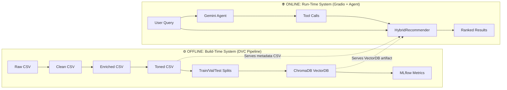
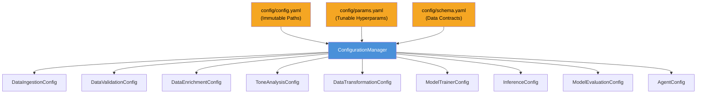
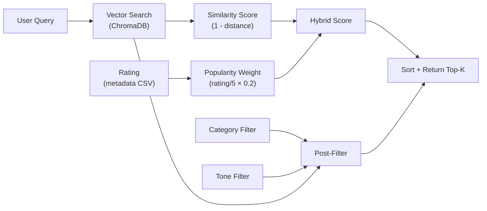
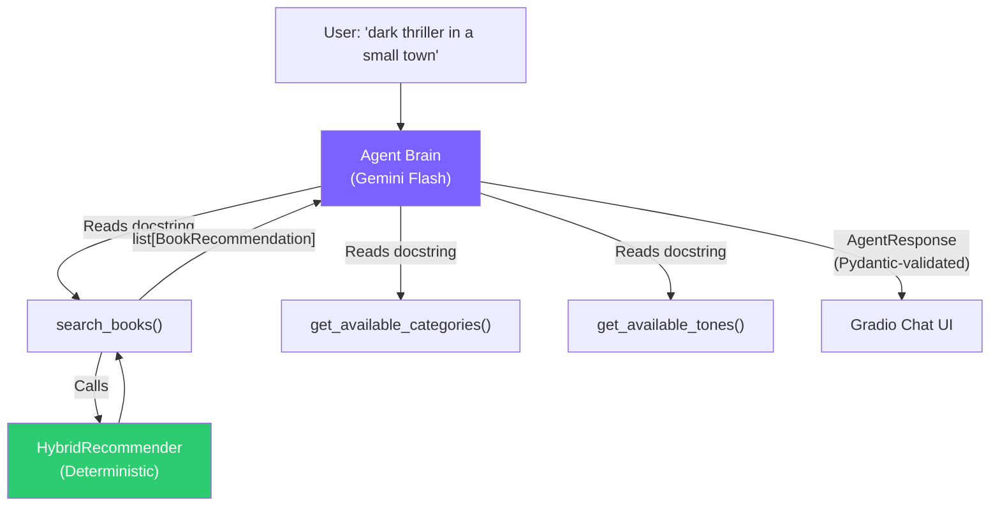
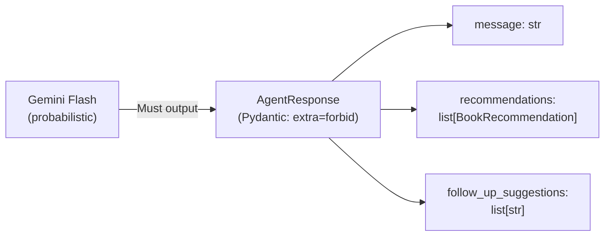
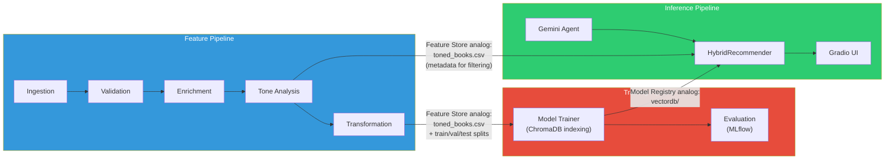

# 🏗️ Hybrid Book Recommender: Systems-Thinking Architecture Walkthrough

> **Purpose:** This document doesn't explain code line-by-line. It teaches you to think in *building blocks* — understanding *why* each component exists, how they connect as a system, how data flows between them, what happens when things break, and the tradeoffs behind every decision. This is the knowledge that separates a portfolio project from a production-grade system.

---

## Table of Contents

1. [The Big Picture: What Problem Are We Really Solving?](#1-the-big-picture)
2. [The Two Systems: Pipeline vs. Runtime](#2-the-two-systems)
3. [Building Block Map: Every Component and Its Role](#3-building-block-map)
4. [The Connective Tissue: How Blocks Communicate](#4-the-connective-tissue)
5. [Data Flow: End-to-End Trace](#5-data-flow)
6. [The Agentic Layer: Brain vs. Brawn in Practice](#6-the-agentic-layer)
7. [Failure Analysis: What Breaks and How the System Responds](#7-failure-analysis)
8. [Key Tradeoffs and Design Decisions](#8-key-tradeoffs)
9. [Mapping to FTI: The MLOps Backbone](#9-mapping-to-fti)
10. [What Makes This Stand Out to Elite Employers](#10-what-makes-this-stand-out)

---

## 1. The Big Picture: What Problem Are We Really Solving? {#1-the-big-picture}

### The Surface Problem
*"Recommend books based on what a user describes."*

### The Real Engineering Problem
Build a system that:
1. **Understands meaning**, not just keywords (semantic search)
2. **Understands mood**, not just genre (emotional analysis)
3. **Converses naturally** — lets an LLM reason about preferences while keeping search *deterministic* (agentic layer)
4. **Is reproducible** — every experiment can be retraced from raw data to UI
5. **Deploys reliably** — from laptop to Docker to EC2 with the same artifacts

> [!IMPORTANT]
> The core insight is that **search and reasoning are fundamentally different problems.** Search is deterministic — given the same query and database, you get the same results. Reasoning is probabilistic — an LLM interprets intent differently each time. The architecture keeps these concerns *surgically separated*.

---

## 2. The Two Systems: Pipeline vs. Runtime {#2-the-two-systems}

The project is not one system — it's **two systems** that share artifacts through well-defined integration points.



### Why this separation matters:

| Aspect | Offline (Pipeline) | Online (Runtime) |
|:---|:---|:---|
| **When it runs** | On demand (`dvc repro`) or CI/CD | Every user request |
| **Latency budget** | Minutes to hours | Milliseconds to seconds |
| **Failure impact** | Blocks retraining, not users | Blocks user experience |
| **State** | Produces immutable artifacts | Consumes artifacts, stateless per request |
| **Orchestrator** | DVC DAG | Gradio event handlers + pydantic-ai |

> [!NOTE]
> The **two integration points** that connect the offline and online systems are:
> 1. **ChromaDB** (`artifacts/model_trainer/vectordb/`) — the vector index
> 2. **Toned Metadata CSV** (`artifacts/tone_analysis/toned_books.csv`) — category, tone, ratings
>
> These are the exact analog of a **Feature Store** and **Model Registry** in the FTI pattern.

---

## 3. Building Block Map: Every Component and Its Role {#3-building-block-map}

### 3.1 Infrastructure Layer (The Foundation)

These are not pipeline stages — they're *utilities* that every building block depends on.

| Block | File(s) | Role | Why It Exists |
|:---|:---|:---|:---|
| **Constants** | [\_\_init\_\_.py](file:///c:/Users/sebas/Desktop/hybrid-book-recommender/src/constants/__init__.py) | Single source of truth for all paths | Eliminates hardcoded strings — change a path once, it propagates everywhere |
| **Logger** | [logger.py](file:///c:/Users/sebas/Desktop/hybrid-book-recommender/src/utils/logger.py) | Centralized rotating-file + console logging | Every component emits structured logs to the same file; `RotatingFileHandler` prevents unbounded disk growth |
| **CustomException** | [exception.py](file:///c:/Users/sebas/Desktop/hybrid-book-recommender/src/utils/exception.py) | Wraps all errors with file + line number context | In a multi-stage pipeline, knowing *which* file and *which* line failed is critical for debugging |
| **Common Utils** | [common.py](file:///c:/Users/sebas/Desktop/hybrid-book-recommender/src/utils/common.py) | YAML reading, directory creation, JSON I/O | DRY principle — every pipeline stage needs to read YAML and create directories |
| **EmbeddingFactory** | [llm_utils.py](file:///c:/Users/sebas/Desktop/hybrid-book-recommender/src/models/llm_utils.py) | Factory pattern for embedding functions | **Training-Serving Parity** — guarantees the same embedding model is used in training (Stage 6) and inference (HybridRecommender) |

### 3.2 Configuration System (The Nervous System)



**WHY three separate YAML files?**

| File | Contains | Changes When... | DVC-Tracked? |
|:---|:---|:---|:---|
| `config.yaml` | System paths: where artifacts live | You restructure the project | No (structural) |
| `params.yaml` | Hyperparameters: batch sizes, thresholds, model names | You tune the system | **Yes** — `dvc.yaml` declares `params:` deps |
| `schema.yaml` | Data contracts: column name mappings, types | The upstream data schema changes | No (contractual) |

**WHY Pydantic entities with `extra="forbid"`?**

The `ConfigurationManager` reads raw YAML → wraps it in `ConfigBox` (dot-access) → hydrates **frozen Pydantic models** (e.g., `ToneAnalysisConfig`). The `extra="forbid"` setting means:

> If someone adds a typo like `bath_size: 32` instead of `batch_size: 32` in YAML, the system **crashes at startup** — not 3 hours into a GPU-intensive enrichment job.

This is the **fail-fast validation** pattern. The cost of a startup crash is zero. The cost of a silent misconfiguration during a 4-hour tone analysis run is enormous.

### 3.3 Pipeline Stages (The Assembly Line)

Each stage follows a **3-layer pattern**: `Pipeline (Conductor) → Component (Worker) → Entity (Contract)`

```
src/pipeline/stage_06_training.py    ← Conducts: loads config, calls component
src/components/model_trainer.py      ← Works: does the actual embedding + indexing
src/entity/config_entity.py          ← Contracts: ModelTrainerConfig validates inputs
```

| Stage | Component | Input Artifact | Output Artifact | Key Decision |
|:---|:---|:---|:---|:---|
| **1. Ingestion** | `DataIngestion` | Remote ZIP URL | `books.csv` | Downloads + extracts; skips if file exists (idempotent) |
| **2. Validation** | `DataValidation` | `books.csv` | `clean_books.csv` | Drops nulls, short descriptions, deduplicates by ISBN — **data quality gate** |
| **3. Enrichment** | `DataEnrichment` | `clean_books.csv` | `enriched_books.csv` | BART-Large-MNLI zero-shot: maps messy categories → 7 clean labels |
| **4. Tone Analysis** | `ToneAnalysis` | `enriched_books.csv` | `toned_books.csv` | distilroberta sentence-level emotion detection → dominant tone per book |
| **5. Transformation** | `DataTransformation` | `toned_books.csv` | `train/val/test.csv` | Stratified 70/15/15 split with `random_state=42` for reproducibility |
| **6. Training** | `ModelTrainer` | `train.csv` | `vectordb/` | Embeds books via `all-MiniLM-L6-v2` → persists in ChromaDB |
| **7. Prediction** | `BatchPrediction` | `vectordb/` + `toned_books.csv` | `results.txt` | Smoke test: runs sample queries to verify the index works |
| **8. Evaluation** | `ModelEvaluation` | `test.csv` + `vectordb/` | `metrics.json` | Logs all params + metrics to MLflow for experiment tracking |

### 3.4 Inference Engine (The Heart)

The [HybridRecommender](file:///c:/Users/sebas/Desktop/hybrid-book-recommender/src/models/hybrid_recommender.py) is the single most important runtime component. It combines three signals:



**The Scoring Formula:**
```
hybrid_score = (1 - cosine_distance) + (rating / 5.0) × popularity_weight
```

**Why this specific formula?**
- `(1 - distance)` normalizes similarity to [0, 1] where 1 = perfect match
- `rating / 5.0` normalizes ratings to [0, 1]
- `popularity_weight = 0.2` is a tunable knob — it gives a slight boost to well-rated books without overwhelming semantic relevance
- The *additive* combination (not multiplicative) means a book with 0 ratings but perfect semantic match still surfaces

### 3.5 Agentic Layer (The Brain)



Covered in depth in [Section 6](#6-the-agentic-layer).

---

## 4. The Connective Tissue: How Blocks Communicate {#4-the-connective-tissue}

### 4.1 Between Pipeline Stages: CSV Files on Disk

Stages communicate through **CSV artifacts**:
```
Stage 1 → books.csv → Stage 2 → clean_books.csv → Stage 3 → enriched_books.csv → Stage 4 → toned_books.csv → Stage 5 → train/val/test.csv → Stage 6 → vectordb/
```

**Why CSVs and not a database?**
- DVC can version and cache CSVs efficiently
- Each stage is independently runnable: `python -m src.pipeline.stage_03_enrichment`
- If Stage 4 changes, DVC only reruns Stages 4→8 (intelligent caching)

### 4.2 Between Config and Components: Pydantic Entities

```
YAML (raw) → ConfigBox (dot-access) → ConfigurationManager → Pydantic Entity (validated, typed)
```

No component ever reads YAML directly. The `ConfigurationManager` is the **single gateway** between static config and runtime code. This means:
- **Testing:** Mock `ConfigurationManager` → mock all config
- **Refactoring:** Change YAML structure → only update `ConfigurationManager`

### 4.3 Between Agent and Search: Dependency Injection

The agent doesn't import `HybridRecommender` directly. Instead:

```
AgentDependencies (dataclass)
├── recommender: HybridRecommender  ← injected at startup
├── categories: list[str]           ← from params.yaml
├── tones: list[str]                ← from params.yaml
├── tone_map: dict[str, str]        ← maps display names → internal labels
├── max_results: int                ← from params.yaml
└── model_name: str                 ← from params.yaml
```

The agent receives these via `RunContext[AgentDependencies]`. This means:
- **Testability:** Inject a mock recommender → test agent logic without ChromaDB
- **Configurability:** Change model or result limits via YAML, no code change
- **Separation:** The agent never knows *how* search works — it just calls a tool

### 4.4 Between Training and Inference: The EmbeddingFactory

This is the **Training-Serving Parity** guarantee:

```python
# In ModelTrainer (training):
embedding_fn = EmbeddingFactory.get_embedding_function(provider="huggingface", model_name="all-MiniLM-L6-v2")

# In HybridRecommender (inference):
embedding_fn = EmbeddingFactory.get_embedding_function(provider="huggingface", model_name="all-MiniLM-L6-v2")
```

Both read from the **same** `params.yaml` keys. If someone changes the training model to `all-mpnet-base-v2` but forgets to update inference, the `params.yaml` structure and the factory make this a *single-point-of-change*.

> [!CAUTION]
> **Training-Serving Skew** is the silent killer of ML systems. If the training embedding model produces 384-dimensional vectors but inference uses a different model producing 768-dimensional vectors, ChromaDB queries silently return garbage — no error, just terrible recommendations. The `EmbeddingFactory` + shared `params.yaml` prevents this.

---

## 5. Data Flow: End-to-End Trace {#5-data-flow}

### 5.1 Offline: From Raw Data to Vector Index

Let's trace a single book through the entire pipeline:

```
📥 Raw: {"isbn13": 9780743273565, "title": "The Great Gatsby", "description": "A classic story...", 
         "categories": "['Fiction']", "average_rating": 4.0, ...}

→ Stage 2 (Validation): 
    - Strip brackets from categories: "'Fiction'" → "Fiction"
    - Check description length > 20 chars ✓
    - Deduplicate by ISBN ✓
    → clean_books.csv

→ Stage 3 (Enrichment): 
    - BART-Large-MNLI classifies description against ["Fiction", "Non-Fiction", "Science", ...]
    - Output: simple_category = "Fiction" (zero-shot, no training data needed)
    → enriched_books.csv

→ Stage 4 (Tone Analysis):
    - Split description into sentences
    - distilroberta classifies each sentence: {joy: 0.12, sadness: 0.05, fear: 0.03, ...}
    - Average across sentences → dominant_tone = "joy" (if max > threshold 0.15)
    → toned_books.csv

→ Stage 5 (Transformation):
    - Random 70/15/15 split with seed=42
    - This book lands in train.csv
    → train.csv, val.csv, test.csv

→ Stage 6 (Training):
    - Create LangChain Document:
      content = "Title: The Great Gatsby\nAuthor: F. Scott Fitzgerald\nDescription: A classic story...\nCategories: Fiction"
      metadata = {isbn: "9780743273565", title: "The Great Gatsby", ...}
    - Embed content → 384-dim vector via all-MiniLM-L6-v2
    - Store in ChromaDB collection "books"
    → vectordb/
```

### 5.2 Online: From User Query to Recommendations

```
🔍 User types: "A dark thriller set in a small town"

→ HybridRecommender.recommend(query="A dark thriller set in a small town", 
                               category_filter=None, tone_filter=None)

→ Step 1: Embed the query → 384-dim vector
→ Step 2: ChromaDB similarity_search_with_score(query, k=250)
           (k = top_k × buffer_multiplier = 50 × 5 = 250)
→ Step 3: For each of 250 candidates:
           - Look up ISBN in toned_books.csv metadata
           - Apply category filter (skip if mismatch)
           - Apply tone filter (skip if mismatch)
           - Compute hybrid_score = (1 - distance) + (rating/5 × 0.2)
→ Step 4: Sort by hybrid_score, return top 50
→ Step 5: Display in Gradio gallery with thumbnails, ratings, descriptions

🤖 OR via Agent:
→ User types: "I want a dark thriller set in a small town"
→ Gemini Flash reasons: "This is about dark thrillers → call search_books"
→ Agent calls: search_books(query="dark thriller small town", 
                             category="Thriller", tone="Suspenseful")
→ HybridRecommender runs with filters
→ Returns list[BookRecommendation] (Pydantic-validated)
→ Agent synthesizes: "Here are some gripping thrillers set in small towns..."
→ AgentResponse rendered as styled HTML book cards in Gradio chat
```

### 5.3 The Buffer Multiplier: Why Fetch 250 When You Need 50?

```
Without filters:  fetch_k = 50 × 5 = 250 candidates
With filters:     fetch_k = 50 × 5 × 10 = 2,500 candidates
```

**Why?** Post-filtering is applied *after* the vector search. If a user asks for "Suspenseful Non-Fiction" and only 3% of books match both filters, fetching only 50 candidates might yield 0 results after filtering. The buffer multiplier ensures enough candidates survive the filter gauntlet.

> [!TIP]
> This is a fundamental tradeoff: **recall vs. latency**. Fetching 2,500 candidates takes longer but guarantees results. The `search_buffer_multiplier` and `filtered_search_boost` are both tunable in `params.yaml` — no code changes needed.

---

## 6. The Agentic Layer: Brain vs. Brawn in Practice {#6-the-agentic-layer}

### 6.1 The Architecture Pattern: "Agent as Tool"

This system uses the **Agent as a Tool** pattern (not the Coordinator pattern):

| Aspect | Agent (Brain) | HybridRecommender (Brawn) |
|:---|:---|:---|
| **Nature** | Probabilistic (LLM) | Deterministic (code) |
| **Role** | Interpret intent, choose tools, synthesize response | Execute vector search, compute scores, filter |
| **State** | Controls full conversation state | Stateless per call |
| **Data trust** | Never trusts LLM-generated data | All data comes from ChromaDB/CSV |
| **Failure mode** | May misinterpret intent | May return empty results |

### 6.2 The Structured Output Contract



**Why is this critical?**

Without structured output, the LLM might respond: *"I recommend 'The Shadow of the Wind' by Carlos Ruiz Zafón."* — but that book might not exist in the database. The system would be *hallucinating book data*.

With the `AgentResponse` contract:
1. The LLM can only populate `recommendations` with data returned by `search_books()` — which reads from ChromaDB
2. The LLM *reasons* about which tool to call and *synthesizes* the conversational message
3. But all factual book data is deterministic

### 6.3 The Tool Docstring as API Contract

```python
def search_books(ctx, query, category=None, tone=None) -> list[BookRecommendation]:
    """Search the book database using natural language with optional filters.
    
    Use this tool to find books matching a user's description. The query should
    capture the themes, topics, or style the user is looking for.
    """
```

The LLM reads these docstrings to decide:
- **When** to call the tool (user wants book recommendations)
- **What** parameters to pass (extract query, category, tone from user message)
- **What** to expect back (a list of `BookRecommendation` objects)

> [!IMPORTANT]
> If the agent misuses tools (e.g., always passes `None` for tone), the fix is to **refine the docstring or system prompt** — not the Python backend. This is Rule 1.7: *Better Prompting*.

### 6.4 The Tone Map: A Display ↔ Internal Translation Layer

```yaml
# params.yaml
tone_map:
  Happy: "joy"
  Suspenseful: "fear"
  Sad: "sadness"
```

The user and agent speak in display names ("Suspenseful"). The recommender speaks in model labels ("fear"). The `tone_map` is the translation layer. Without it, the agent would need to know that "Suspenseful" maps to the distilroberta label "fear" — leaking internal implementation details into the LLM prompt.

---

## 7. Failure Analysis: What Breaks and How the System Responds {#7-failure-analysis}

### 7.1 Failure Map

| Component | Failure | Impact | Mitigation |
|:---|:---|:---|:---|
| **Data Ingestion** | URL unreachable | Pipeline halts at Stage 1 | Idempotent: skips download if file exists locally |
| **Data Validation** | Empty dataset after cleaning | Pipeline halts, status file written | `STATUS_FILE` records failure; downstream stages see missing artifact |
| **Data Enrichment** | BART model OOM | Stage 3 fails | `batch_size: 16` in params.yaml; configurable without code change |
| **Tone Analysis** | Single book classification error | That book gets `"neutral"` tone | `try/except` per book with warning log; pipeline continues |
| **Model Training** | Rate limit (429) on Gemini embeddings | Temporary pause | Exponential backoff: retry 5× with 15s/30s/45s waits |
| **ChromaDB** | VectorDB corrupted or missing | Recommender fails to initialize | `init_recommender()` returns `None`; UI shows error message |
| **HybridRecommender** | ISBN not found in metadata CSV | That book is skipped | `if isbn in self.books_metadata.index:` — graceful skip with warning |
| **Agent (Gemini)** | API key missing or rate limited | Agent chat fails | `chat()` returns fallback `AgentResponse` with error message + "Try the Search tab" |
| **Agent Dependencies** | Recommender init fails | Agent tab disabled | `create_agent_dependencies()` returns `None`; chat shows warning |
| **Gradio UI** | Frontend crash | User session lost | Stateless per-request; refresh recovers |

### 7.2 The Graceful Degradation Hierarchy

```
Full System (Agent + Search + VectorDB + Metadata)
    ↓ Agent fails?
Degraded: Search Tab still works (direct HybridRecommender)
    ↓ VectorDB fails?
Degraded: UI shows "System Error: Recommender not initialized"
    ↓ Everything fails?
Minimum: Static error page via Gradio
```

> [!NOTE]
> The system is designed so that the **most deterministic, most reliable path** (direct search) works independently of the **most fragile path** (LLM agent). The agent is an *enhancement*, not a dependency.

### 7.3 DVC as a Failure Recovery Mechanism

If Stage 4 (Tone Analysis) fails midway through a run, DVC's cache means:
1. Stages 1-3 don't re-execute (their outputs haven't changed)
2. Fix the issue → `dvc repro` → only Stages 4-8 re-run
3. If params haven't changed, even passing stages are skipped

This transforms *hours* of potential re-computation into *minutes*.

---

## 8. Key Tradeoffs and Design Decisions {#8-key-tradeoffs}

### 8.1 HuggingFace Embeddings vs. Gemini Embeddings

| Aspect | HuggingFace (`all-MiniLM-L6-v2`) | Gemini (`embedding-001`) |
|:---|:---|:---|
| **Latency** | Local computation, no network | API call per batch, network-dependent |
| **Cost** | Free | Free tier limited; 429 errors at scale |
| **Privacy** | Data never leaves the machine | Data sent to Google servers |
| **Dimension** | 384-dim | 768-dim |
| **Quality** | Good for short texts | Potentially better for nuanced text |

**Decision:** HuggingFace is the default. The `EmbeddingFactory` + `params.yaml` make switching a one-line YAML change. The retry logic in `ModelTrainer` handles Gemini's rate limits if you switch.

### 8.2 Zero-Shot Classification vs. Fine-Tuned Model

| Aspect | Zero-Shot (BART-Large-MNLI) | Fine-Tuned |
|:---|:---|:---|
| **Setup cost** | Zero — no labeled training data needed | Requires labeled dataset |
| **Accuracy** | Good enough for broad categories | Higher for specific domains |
| **Maintenance** | Add a new label to `candidate_labels` in YAML | Retrain the model |
| **Compute** | ~0.5-1s per book on CPU | Similar, but one-time training cost |

**Decision:** Zero-shot wins for a portfolio project where the category taxonomy is simple and stable. The `candidate_labels` list in `params.yaml` is the single point of change.

### 8.3 Sentence-Level vs. Document-Level Tone Analysis

| Aspect | Sentence-Level (chosen) | Document-Level |
|:---|:---|:---|
| **Accuracy** | Captures tonal shift within descriptions | Averages out nuance |
| **Compute** | `20 sentences × N books` classifier calls | `N books` classifier calls |
| **Configurability** | `max_sentences_per_book`, `min_sentence_len`, `detection_threshold` | Less to tune |

**Decision:** Sentence-level. A book description might start joyful and turn suspenseful — sentence-level analysis captures this. The `detection_threshold: 0.15` ensures only confident predictions override "neutral."

### 8.4 Post-Filtering vs. Pre-Filtering

| Aspect | Post-Filter (chosen) | Pre-Filter (ChromaDB metadata) |
|:---|:---|:---|
| **Recall** | Higher — semantic search sees all books | Lower — may miss semantically relevant books that aren't tagged |
| **Latency** | Fetch more candidates, filter in Python | Fewer candidates, but filtering in DB |
| **Flexibility** | Filter on any metadata field | Limited to indexed metadata |

**Decision:** Post-filtering with a large buffer multiplier. The tags (`simple_category`, `dominant_tone`) are enriched after the fact and stored in CSV, not ChromaDB metadata. Post-filtering is the pragmatic choice that keeps the vector index simple.

### 8.5 pydantic-ai vs. LangChain Agents

| Aspect | pydantic-ai (chosen) | LangChain AgentExecutor |
|:---|:---|:---|
| **Output typing** | Native Pydantic `output_type=AgentResponse` | Requires `PydanticOutputParser` wrapper |
| **Complexity** | Minimal abstraction — ~40 lines for full agent | Heavy abstraction chain |
| **Tool definition** | Plain Python functions with type hints | `@tool` decorator + schema objects |
| **Dependency injection** | Built-in `RunContext[AgentDependencies]` | Manual wiring |

**Decision:** pydantic-ai is chosen for its *minimal abstraction*. The agent definition is ~40 lines. The tool functions are plain Python with docstrings. There's no framework magic to debug.

---

## 9. Mapping to FTI: The MLOps Backbone {#9-mapping-to-fti}

This project implements the **Feature-Training-Inference (FTI) pattern**:



| FTI Concept | Implementation in This Project |
|:---|:---|
| **Feature Store** | `toned_books.csv` — contains all engineered features (categories, tones, emotion scores) used by both training and inference |
| **Model Registry** | `artifacts/model_trainer/vectordb/` — the trained ChromaDB index, versioned by DVC |
| **Feature Pipeline** | Stages 1-5: Ingestion → Validation → Enrichment → Tone → Transformation |
| **Training Pipeline** | Stage 6 (Model Trainer) + Stage 8 (MLflow Evaluation) |
| **Inference Pipeline** | `HybridRecommender` + Gradio UI + Agent Layer |
| **Integration Point 1** | `train.csv` flows from Feature Pipeline → Training Pipeline |
| **Integration Point 2** | `vectordb/` flows from Training Pipeline → Inference Pipeline |
| **Experiment Tracking** | MLflow with SQLite backend — logs all params, metrics, run metadata |
| **Data Versioning** | DVC tracks all intermediate artifacts + `params.yaml` |
| **Reproducibility** | `random_state=42` in splits; `dvc repro` recreates everything from source |

---

## 10. What Makes This Stand Out to Elite Employers {#10-what-makes-this-stand-out}

### 10.1 It's Not a Notebook — It's a System

```
❌ "I trained a model in a Jupyter notebook"
✅ "I built an 8-stage reproducible MLOps pipeline with DVC, 
    a hybrid inference engine, and an agentic conversation layer"
```

### 10.2 The Architecture Principles You Can Articulate

| Principle | Evidence |
|:---|:---|
| **Separation of Concerns** | 3-layer pattern: Pipeline → Component → Entity |
| **Brain vs. Brawn** | Agent reasons; HybridRecommender computes |
| **Training-Serving Parity** | `EmbeddingFactory` shared between training and inference |
| **Fail-Fast Validation** | `extra="forbid"` on all Pydantic entities |
| **Data Contracts** | `schema.yaml` maps logical → physical column names |
| **Graceful Degradation** | Agent failure → fallback to Search tab |
| **Configuration as Code** | All hyperparameters in `params.yaml`, DVC-tracked |
| **Structured Output** | LLM never free-texts book data; `AgentResponse(BaseModel)` |
| **Dependency Injection** | `AgentDependencies` injected via `RunContext` |
| **Idempotent Operations** | DVC skips cached stages; ingestion skips existing downloads |

### 10.3 The Questions You Can Now Answer

> [!TIP]
> **Prepare for these interview questions** — they test systems thinking, not code recall:
>
> 1. *"How do you ensure the same embeddings are used in training and inference?"*
>    → EmbeddingFactory pattern + shared params.yaml
>
> 2. *"What happens if the LLM hallucinates a book that doesn't exist?"*
>    → Impossible by design. All recommendations come from ChromaDB via tool calls. AgentResponse enforces Pydantic validation.
>
> 3. *"How would you scale this to 1M books?"*
>    → ChromaDB supports sharding. The pipeline is already batched. The agent is stateless. Deploy multiple Gradio workers behind a load balancer.
>
> 4. *"What's the weakest link in the system?"*
>    → The post-filtering strategy. With highly restrictive filters on a large catalog, the buffer multiplier may not be enough. Solution: move to pre-filtering with ChromaDB metadata indexes.
>
> 5. *"How do you version your experiments?"*
>    → DVC versions data + params. MLflow versions metrics + hyperparameters. Together they give full lineage from raw data → model → evaluation.
>
> 6. *"Why not use LangChain agents instead of pydantic-ai?"*
>    → pydantic-ai gives native structured output, minimal abstraction, and built-in dependency injection. LangChain's agent abstraction would add complexity without value for this use case.
>
> 7. *"How does the system degrade if the Gemini API goes down?"*
>    → The Search tab works independently (uses local HuggingFace embeddings). Only the AI Assistant tab (which calls Gemini for reasoning) is affected. The agent returns a graceful fallback response.

### 10.4 The Mental Model

Think of this system as a **bookstore with two entrances**:

- **Front door (Search tab):** Walk in, browse shelves organized by topic, pick books that look interesting. Deterministic, fast, reliable.
- **Concierge desk (Agent tab):** Tell a knowledgeable assistant what mood you're in, what themes interest you. They walk to the shelves for you, pick books, and explain *why* each one fits. Probabilistic, conversational, enhanced.

Both entrances lead to the **same shelves** (ChromaDB + metadata). The concierge adds intelligence but never adds books that aren't on the shelves.

---

*This walkthrough was built by tracing every file in the source tree, understanding each building block's role, and mapping the connections between them. The goal is not to memorize code — it's to internalize the system topology so deeply that you can redraw it from memory and defend every design decision.*
