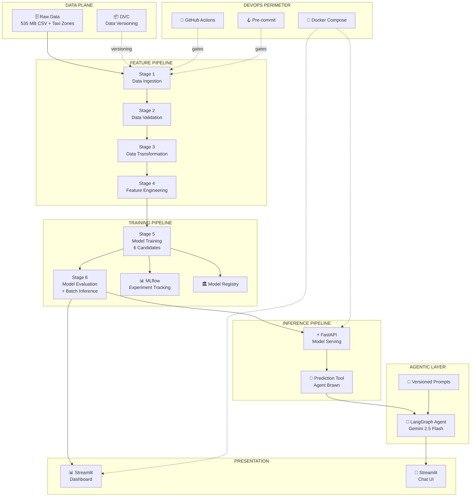
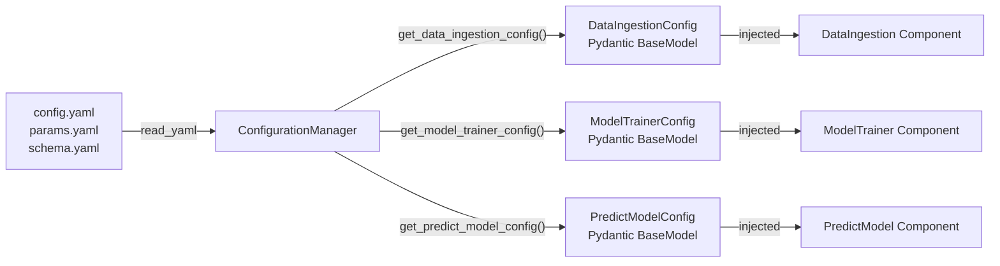
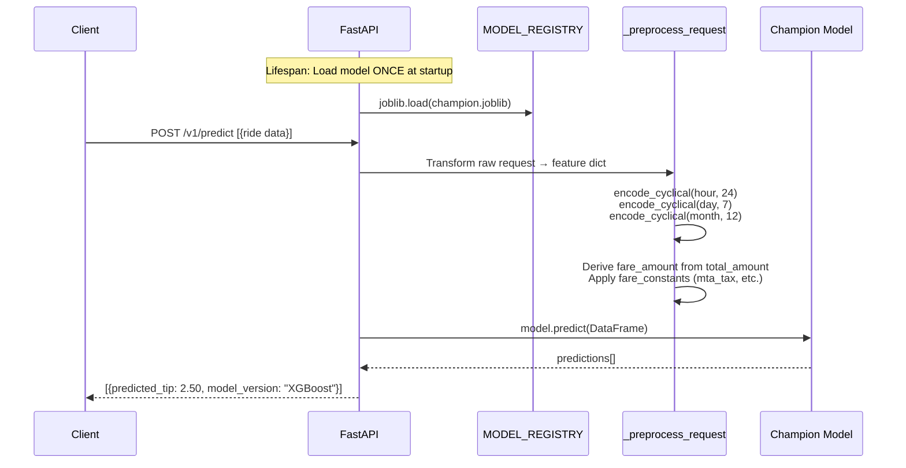
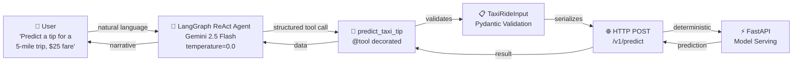
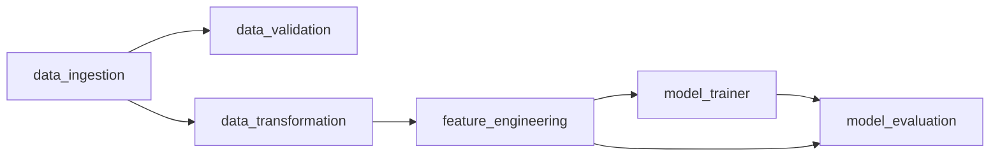
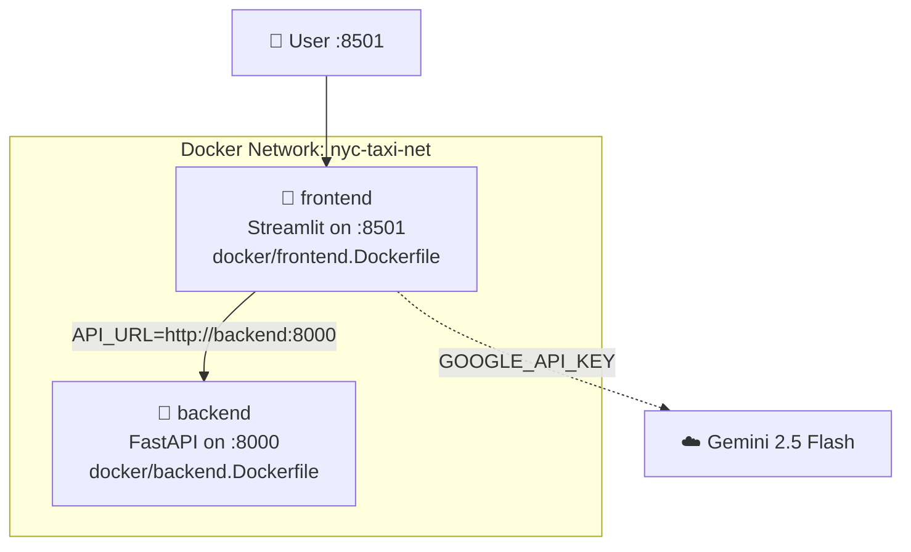
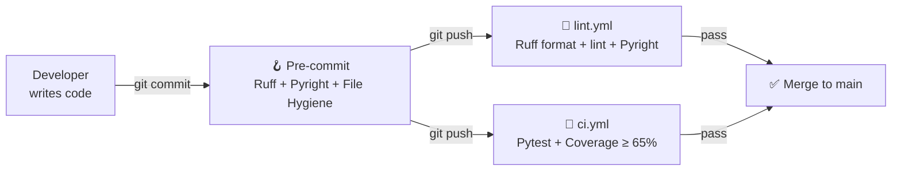
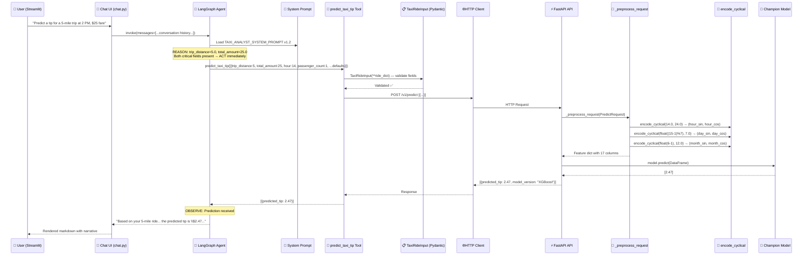

# 🏗️ Systems-Thinking Architecture Walkthrough

## NYC Taxi Tips Prediction — Production-Grade Hybrid Agentic MLOps

> **Mindset:** This document is written from the perspective of an engineer who can articulate *why* the system is built the way it is — not just *what* each file does. Every section answers: **Why does this exist? How does it connect? What breaks if it fails?**

---

## 1. The 30,000-Foot View



### What this diagram tells you

The system is **not** a monolith. It is a **decoupled assembly line** of three independent pipelines (Feature → Training → Inference) glued together by two critical integration points: the **Artifacts Directory** (acting as a Feature Store) and the **Model Registry** (decoupling training from serving). On top of that, an **Agentic Layer** adds a natural-language reasoning interface that *never* does math — it only orchestrates the deterministic tools below it.

---

## 2. The Configuration Spine — Why Config is an Architecture, Not a File

> **Key Insight:** Every pipeline stage is a *stateless worker* that receives an immutable configuration object at birth. No component reads YAML. No component guesses paths. This is the single most important design decision in the entire system.

### 2.1 The Three Pillars of Configuration

| File | Purpose | What Changes It |
|------|---------|-----------------|
| [config.yaml](file:///c:/Users/sebas/Desktop/nyc-taxi-tips-prediction/config/config.yaml) | **System Structure** — immutable paths, directories, fare constants | Only when the physical artifact layout changes |
| [params.yaml](file:///c:/Users/sebas/Desktop/nyc-taxi-tips-prediction/config/params.yaml) | **Tunable Hyperparameters** — model params, thresholds, split months | Every experiment |
| [schema.yaml](file:///c:/Users/sebas/Desktop/nyc-taxi-tips-prediction/config/schema.yaml) | **Data Contract** — column names, types, target column definition | Only when the upstream data source schema changes |

> [!IMPORTANT]
> **Why separate them?** Because they change at different frequencies for different reasons. A data engineer changes `config.yaml` when infrastructure moves. A data scientist changes `params.yaml` when tuning. A data contract change in `schema.yaml` triggers a full pipeline re-validation. Mixing them creates coupling that breaks teams.

### 2.2 The Configuration Manager — The Brain of the System

[configuration.py](file:///c:/Users/sebas/Desktop/nyc-taxi-tips-prediction/src/config/configuration.py) is the **single source of truth hydrator**. It:

1. **Reads** all three YAML files at instantiation
2. **Creates artifact directories** before any stage runs (preventing file-not-found races)
3. **Hydrates** Pydantic `BaseModel` entities with `ConfigDict(extra="forbid")` — meaning if you pass an unexpected key, **the system explodes immediately** rather than silently ignoring a typo



> [!TIP]
> **Why Pydantic with `extra="forbid"`?** This is a *fail-fast* design. In production ML systems, the most dangerous bugs are silent ones — a misspelled hyperparameter that defaults to something unexpected. Pydantic catches this *at configuration time*, before a 4-hour training run begins.

### 2.3 Entity Layer — The Data Contracts

[config_entity.py](file:///c:/Users/sebas/Desktop/nyc-taxi-tips-prediction/src/entity/config_entity.py) defines **7 frozen data contracts**, one per pipeline stage. Each entity is:

- **Typed**: `Path`, `float`, `str`, `dict[str, Any]` — no `dict` or `**kwargs` anywhere
- **Self-documenting**: Every attribute has a docstring
- **Validated on construction**: Pydantic validates types, ranges, and presence *before* any pipeline logic executes

[api_entity.py](file:///c:/Users/sebas/Desktop/nyc-taxi-tips-prediction/src/entity/api_entity.py) defines the **API boundary contracts**:
- `PredictRequest` — with `Field(gt=0)`, `Field(ge=0, le=23)` constraints
- `PredictResponse` — structured model output

> **The "No Untyped Dictionaries" Rule:** Data never flows between components as raw `dict`. It always flows through a Pydantic model. This eliminates an entire class of bugs where a pipeline silently processes garbage data.

---

## 3. The Feature Pipeline — From Raw Data to ML-Ready Features

> **Key Insight:** The Feature Pipeline is the most underappreciated part of any ML system. It's where 80% of real-world bugs live, and where data quality issues silently metastasize into model failures months later.

### 3.1 Stage 1: Data Ingestion — The Boundary Guardian

[data_ingestion.py](file:///c:/Users/sebas/Desktop/nyc-taxi-tips-prediction/src/components/data_ingestion.py)

**What it does:**
1. Reads a 535 MB raw CSV (distilled 2023 Yellow Taxi Trip data) using **Polars** (not Pandas)
2. Reads an external NYC Taxi Zones reference file
3. Enriches trips with geographic context via two left joins (Pickup Borough/Zone, Dropoff Borough/Zone)
4. Saves as **Parquet** — a columnar format that compresses 535 MB → ~135 MB

**Why Polars, not Pandas?**
- Polars is ~10-50x faster on large datasets due to its Rust engine and lazy evaluation
- Polars operations are more memory-efficient (doesn't copy data on type casts)
- The schema mapping (`_get_polars_schema()`) enforces column types *at read time*, preventing type coercion surprises downstream

**Why enrich with zones?**
Borough-level features (Manhattan pickup → JFK dropoff) carry enormous predictive signal for tip behavior that raw `PULocationID=132` integers don't express to the model. This is **domain knowledge encoded as a feature**, not just data shuffling.

**What breaks if this fails?**
Everything. This is the DAG root. DVC will refuse to execute any downstream stage because `artifacts/data_ingestion/enriched_trip_data.parquet` won't exist. The system is intentionally **fail-fast** — no stage silently skips its input.

### 3.2 Stage 2: Data Validation — The Gatekeeper

[data_validation.py](file:///c:/Users/sebas/Desktop/nyc-taxi-tips-prediction/src/components/data_validation.py)

**What it does:**
1. Loads the enriched Parquet
2. Checks that **all schema-defined columns exist** in the data
3. Runs guardrail checks (e.g., negative trip distances — logged but not failed)
4. Writes a `status.txt` file that downstream stages consume

**Why is this a separate stage?**
Because data quality problems should be caught **before** expensive transformation and training runs begin. This follows the *"Fail Early"* principle from the FTI pattern. In a production system, this stage would be integrated with Great Expectations for statistical validation (data drift, distribution checks).

**Design tradeoff:** Currently, validation logs warnings but doesn't hard-block on data quality issues beyond missing columns. This is a deliberate choice for prototype flexibility — in production, you'd want hard gates (e.g., "if >5% null rate in `tip_amount`, halt the pipeline").

### 3.3 Stage 3: Data Transformation — The Cleaning Engine

[data_transformation.py](file:///c:/Users/sebas/Desktop/nyc-taxi-tips-prediction/src/components/data_transformation.py)

**What it does:**
1. **Imputation**: `airport_fee` → 0.0, `passenger_count` → 1 (if null/0), `RatecodeID` → 99 (sentinel)
2. **Column Dropping**: `store_and_fwd_flag` (irrelevant to tipping behavior)
3. **Filtering**: 
   - No negative financial values in *any* column (catches refunds/errors)
   - Trip distance bounded: 0.5 < x < 100 miles (config-driven thresholds)
   - Total amount bounded: $3.70 ≤ x ≤ $1,000 (config-driven)
4. **DateTime Parsing**: `tpep_pickup_datetime` parsed with strict format, null-dropped
5. Saves `cleaned_trip_data.parquet`

**Why are thresholds config-driven?**
```yaml
DataCleaning:
  min_trip_distance: 0.5
  max_trip_distance: 100
  min_total_amount: 3.70   # NYC base fare
  max_total_amount: 1000
```
Because these are **business decisions**, not code decisions. A domain expert might say "we should include $0.25 trips for accessibility analysis." Moving this to `params.yaml` means no code change is needed — just a YAML edit and `dvc repro`.

**What's the `pl.all_horizontal()` pattern doing?**
This is a Polars-idiomatic way to create a compound filter mask across multiple columns without chaining `.filter()` calls (which would create intermediate DataFrames). It builds a single Boolean mask and applies it in one pass — significantly more memory-efficient on a 135 MB dataset.

### 3.4 Stage 4: Feature Engineering — The Signal Creator

[feature_engineering.py](file:///c:/Users/sebas/Desktop/nyc-taxi-tips-prediction/src/components/feature_engineering.py)

**What it does:**
1. **Cyclical Feature Encoding** for hour, day-of-week, and month
2. **Temporal Splitting** into Train (Jan–Aug), Validation (Sep–Oct), Test (Nov–Dec)

**Why cyclical encoding?**

> [!IMPORTANT]
> This is one of the most critical domain decisions in the system. Without it, the model would treat Hour 23 and Hour 0 as maximally distant points — when in reality, they're adjacent.

The function [encode_cyclical](file:///c:/Users/sebas/Desktop/nyc-taxi-tips-prediction/src/utils/feature_utils.py) projects a periodic value onto the unit circle using `sin(2π·v/T)` and `cos(2π·v/T)`. This creates two features where:
- Temporally adjacent values are geometrically adjacent
- The model can learn smooth periodic patterns (rush hour, weekend effects)

**Why is `encode_cyclical()` in `utils/feature_utils.py`, not inline?**

This is the **training-serving skew prevention architecture**. The *exact same function* is called by:
1. `feature_engineering.py` during batch training
2. `predict_api.py` during real-time inference

If these were two separate implementations, any drift between them would cause the model to receive features at inference time that don't match what it was trained on — producing subtly wrong predictions that are nearly impossible to debug.

**Why temporal splitting (not random)?**
Random splits would **leak future information** into training. A model trained on December data would "know" December tipping patterns when predicting October. Temporal splitting simulates real-world deployment: train on the past, validate on the recent past, test on the future.

```
Jan ─── Feb ─── ... ─── Aug │ Sep ─── Oct │ Nov ─── Dec
         TRAIN (67%)        │  VAL (17%)  │ TEST (17%)
```

---

## 4. The Training Pipeline — From Features to Champion Model

### 4.1 Stage 5: Model Training — The Arena

[model_trainer.py](file:///c:/Users/sebas/Desktop/nyc-taxi-tips-prediction/src/components/model_trainer.py)

**What it does:**
1. Loads train + validation splits
2. Optionally subsamples for fast local iteration (`subsample_fraction: 0.2`)
3. Trains **6 candidate models**: Baseline (DummyRegressor), ElasticNet, Ridge, RandomForest, XGBoost, GradientBoosting
4. Logs all params + metrics to **MLflow** per model
5. Applies a **multi-metric weighted champion selection** algorithm
6. Saves the winner as a `.joblib` file + registers it in MLflow

**Why 6 candidates, not just XGBoost?**

> [!TIP]
> Because the Baseline model (DummyRegressor with `strategy="mean"`) sets the **floor**. If your fancy XGBoost can't beat "just predict the mean tip," your entire feature engineering strategy is wrong. This is an engineering discipline, not laziness.

The model hierarchy is intentional:
- **Baseline**: The "minimum viable prediction" — if nothing beats this, your features are garbage
- **Linear Models (ElasticNet, Ridge)**: Test whether the relationship is approximately linear
- **Tree Ensembles (RF, GB, XGBoost)**: Capture non-linear interactions

**The Champion Selection Algorithm:**

```yaml
Training:
  selection_metrics:
    mae: 0.7   # Weight for MAE (lower is better)
    mse: 0.2   # Weight for MSE (lower is better)
    r2: 0.5    # Weight for R² (higher is better)
```

This is a **min-max normalized weighted scoring** system:

1. For each metric, normalize across all 6 models to [0, 1]
2. For "lower is better" metrics (MAE, MSE): `norm = (max - val) / (max - min)`
3. For "higher is better" metrics (R²): `norm = (val - min) / (max - min)`
4. Weighted sum = Σ(weight × norm_value)
5. Highest weighted score wins

**Why not just pick lowest MAE?** Because different business contexts prioritize different metrics. A ride-sharing company might heavily weight R² (variance explained) because they need reliable predictions. A tipping app might weight MAE (average dollar error) because they communicate tip amounts directly to users. The weights in `params.yaml` make this a **business-configurable decision**.

### 4.2 Stage 6: Model Evaluation + Batch Inference — The Exit Gate

[model_evaluation.py](file:///c:/Users/sebas/Desktop/nyc-taxi-tips-prediction/src/components/model_evaluation.py) + [predict_model.py](file:///c:/Users/sebas/Desktop/nyc-taxi-tips-prediction/src/components/predict_model.py)

This stage does **two things** (orchestrated by [stage_06_model_evaluation.py](file:///c:/Users/sebas/Desktop/nyc-taxi-tips-prediction/src/pipeline/stage_06_model_evaluation.py)):

1. **Evaluate**: Load champion model → predict on test set → compute MAE/MSE/R² → save `metrics.json` → log to MLflow
2. **Batch Inference**: Simulate a production batch job → save `inference_results.csv`

**Why combine evaluation and inference in one stage?** Because in the DVC DAG, both depend on the same inputs (test data + trained model). Running them together avoids redundant model loading.

**The `model_dir.glob("*.joblib")` pattern**: The trainer saves the champion with its name as the filename (e.g., `XGBoost.joblib`). The evaluator doesn't hardcode the name — it globs for any `.joblib` in the directory. This means the champion selection is **decoupled from evaluation** — you can swap champions by simply re-running training, and evaluation adapts automatically.

---

## 5. The Inference Pipeline — From Trained Model to Real-Time API

### 5.1 The FastAPI Serving Layer — The Brawn

[predict_api.py](file:///c:/Users/sebas/Desktop/nyc-taxi-tips-prediction/src/api/predict_api.py)



**Key Design Decisions:**

1. **Lifespan Model Loading**: The model is loaded *once* at startup via `@asynccontextmanager`, not per-request. This eliminates I/O latency from every prediction call.

2. **`MODEL_REGISTRY` as a global dict**: This is a lightweight in-process model registry. In production, you'd replace this with MLflow's `pyfunc.load_model()` pointing at a versioned model URI.

3. **`_preprocess_request()` shares `encode_cyclical()`**: The same [feature_utils.py](file:///c:/Users/sebas/Desktop/nyc-taxi-tips-prediction/src/utils/feature_utils.py) function used during training is used during inference. This is the **anti-skew architecture** in action.

4. **Fare Decomposition**: The API derives `fare_amount` from `total_amount - airport_fee - congestion_surcharge - tolls_amount`. This is necessary because the model was trained with `fare_amount` as a separate feature, but users only know their total fare.

5. **Column Alignment with `feature_names_in_`**: After preprocessing, the API checks the model's expected feature names and reorders/pads the DataFrame accordingly. This prevents "feature mismatch" crashes when the model expects columns in a specific order.

6. **Versioned API Router (`/v1/`)**: All endpoints live under `/v1/`. This enables backward-compatible evolution — when v2 changes the request schema, v1 clients continue working.

### 5.2 Feature Importance Endpoint

The `/v1/feature-importance` endpoint uses [model_utils.py](file:///c:/Users/sebas/Desktop/nyc-taxi-tips-prediction/src/utils/model_utils.py) which employs **duck typing** — `hasattr(model, "feature_importances_")` rather than `isinstance(model, RandomForestRegressor)`. This makes the utility agnostic to the specific model library, supporting any scikit-learn-compatible estimator without hard import dependencies.

---

## 6. The Agentic Layer — The Brain

> **Core Principle:** The Brain (LLM) reasons and routes. The Hands (Tools) execute deterministically. The LLM **never** computes a feature, stores a prediction, or calls the model directly.

### 6.1 Architecture



### 6.2 The Three Layers of the Brain

#### Layer 1: The System Prompt — [prompts.py](file:///c:/Users/sebas/Desktop/nyc-taxi-tips-prediction/src/agents/prompts.py)

The prompt is **versioned** (`v1.2 — Fast-Action UX`), **stored as a module constant** (no naked strings), and encodes critical behavioral rules:

- **"Critical Fields Only"**: Only `trip_distance` and `total_amount` are required — the LLM fills all other fields with sensible defaults
- **"IMMEDIATE EXECUTION"**: The moment both critical fields exist in conversation history, the agent *must* call the tool — no unnecessary clarification loops
- **"Context Memory"**: The agent checks conversation history before asking for fields the user already provided

**Why temperature=0.0?** Because tool calls must be deterministic. A creative temperature would cause the agent to sometimes format the tool call differently, leading to validation failures.

#### Layer 2: The Agent — [taxi_analyst_agent.py](file:///c:/Users/sebas/Desktop/nyc-taxi-tips-prediction/src/agents/taxi_analyst_agent.py)

Uses LangGraph's `create_react_agent()` — a prebuilt **ReAct (Reasoning + Acting)** pattern:
1. **Reason**: Analyze the user's message, check conversation history
2. **Act**: Decide to call `predict_taxi_tip` or respond conversationally
3. **Observe**: Read the tool response
4. **Respond**: Generate a natural language narrative with the prediction

The `@tool` decorated function `predict_taxi_tip()` is the **boundary between probabilistic and deterministic computation**. Everything above it is reasoning; everything below it is rigid execution.

#### Layer 3: The Tool — [taxi_prediction_tool.py](file:///c:/Users/sebas/Desktop/nyc-taxi-tips-prediction/src/tools/taxi_prediction_tool.py)

`TaxiPredictionTool` is a **pure deterministic microservice client**:
- Input: `list[TaxiRideInput]` — Pydantic-validated, no ambiguity
- Execution: HTTP POST to `/v1/predict` with a 5-second timeout
- Output: `list[dict]` with `predicted_tip` field
- Error boundary: Custom `PredictionToolError` wrapping `Timeout`, `HTTPError`, `ConnectionError`

**Why a custom exception?** Because the LLM needs a *descriptive error string* to self-correct ("The ML serving API timed out"), while the tracing layer needs *structured metadata* for debugging. `PredictionToolError` serves both audiences.

### 6.3 Error Taxonomy in the Chat UI

[chat.py](file:///c:/Users/sebas/Desktop/nyc-taxi-tips-prediction/src/app/pages/chat.py) classifies errors into three categories:

| Error Type | Detection | User Message |
|-----------|-----------|--------------|
| **Brain Error** (Quota) | `RateLimitError`, `RESOURCE_EXHAUSTED` | "Your Google API Key has hit a rate limit" |
| **Brawn Error** (API Offline) | `ConnectionError`, `localhost:8000` | "The analyst can't reach the tip prediction model" |
| **Unknown Error** | Catch-all | "The analyst encountered an unexpected error" |

This taxonomy gives users **actionable guidance** rather than cryptic stack traces.

---

## 7. The Pipeline Orchestration Layer — Two Runners, One DAG

### 7.1 The "Conductor vs. Worker" Pattern

Every pipeline stage follows a strict two-file pattern:

| File | Role | Responsibility |
|------|------|----------------|
| `src/pipeline/stage_0X_*.py` | **Conductor** | Instantiate `ConfigurationManager`, extract config, invoke component |
| `src/components/*.py` | **Worker** | Execute the actual data processing logic |

**Why this separation?** Because the Worker is **unit-testable in isolation** — you can inject a mock `DataIngestionConfig` without touching YAML files. The Conductor is the **integration glue** that connects config to worker. This is the Strategy Pattern applied to ML pipelines.

Each Conductor also serves as a **standalone entry point** via `if __name__ == "__main__":`, enabling DVC to invoke individual stages independently.

### 7.2 DVC — The Reproducibility Engine

[dvc.yaml](file:///c:/Users/sebas/Desktop/nyc-taxi-tips-prediction/dvc.yaml) defines a **6-stage DAG** where each stage declares:
- `cmd`: The exact command to execute
- `deps`: Input files/code that trigger re-execution when changed
- `outs`: Output artifacts that are cached and versioned
- `metrics`: Tracked metric files (with `cache: false` so they're always readable)



**Why DVC, not Airflow/Prefect?** Scale-appropriate tooling. DVC is a *lightweight, Git-native* pipeline runner perfect for individual ML projects. Airflow adds infrastructure complexity (scheduler, workers, metadata DB) that only pays off at team/org scale. DVC gives you reproducibility and artifact caching with zero infrastructure.

**The `dvc.lock` file** is the **cryptographic receipt** — it stores MD5 hashes of every dependency and output. Running `dvc repro` only re-executes stages whose inputs have changed. If `params.yaml` changes but `schema.yaml` doesn't, only stages that depend on `params.yaml` re-run.

### 7.3 `main.py` — The Manual Orchestrator

[main.py](file:///c:/Users/sebas/Desktop/nyc-taxi-tips-prediction/main.py) provides a **Python-native runner** for development/debugging. It runs all 6 stages sequentially — useful when you want to step through stages in a debugger without DVC's subprocess isolation.

---

## 8. The Utility Layer — Cross-Cutting Concerns

### 8.1 Logger — [logger.py](file:///c:/Users/sebas/Desktop/nyc-taxi-tips-prediction/src/utils/logger.py)

- **Rotating File Handler**: 5 MB × 5 files — prevents log files from growing unbounded
- **Dual Output**: Rich console handler (pretty) + file handler (machine-readable)
- **UTF-8 Force**: Windows console encoding fix — without this, emoji in log messages crash on Windows
- **Headline Separators**: Each script writes a visual headline to the log file, making multi-stage logs scannable

### 8.2 Exception — [exception.py](file:///c:/Users/sebas/Desktop/nyc-taxi-tips-prediction/src/utils/exception.py)

`CustomExceptionError` extracts **file name and line number** from the traceback and embeds them in the error message. In an MLOps pipeline, you might see errors from 6 different modules — knowing *exactly* which file and line failed saves hours of debugging.

### 8.3 MLflow Configuration — [mlflow_config.py](file:///c:/Users/sebas/Desktop/nyc-taxi-tips-prediction/src/utils/mlflow_config.py)

A **3-tier priority system** for resolving the tracking URI:

1. **Environment variable** (`MLFLOW_TRACKING_URI`) — CI/CD and Docker override
2. **Environment-based defaults** — production *requires* a URI (hard fail), staging has a default
3. **YAML fallback** — reads from `params.yaml` for local development

This hierarchy ensures the same code works across local development, CI, staging, and production without any code changes — only environment configuration changes.

---

## 9. The Serving Infrastructure — Containers & Composition

### 9.1 The Two-Container Architecture



**Why two containers, not one?**

This is the **Brain vs. Brawn** principle materialized as infrastructure:

| Container | Role | Scales By | Failure Impact |
|-----------|------|-----------|----------------|
| `backend` | Deterministic model served | Horizontal replicas | Predictions unavailable, but UI survives |
| `frontend` | Agentic UI + LLM reasoning | Vertical (LLM is the bottleneck) | UI down, but API still serves predictions |

If the LLM quota is exhausted, the prediction API continues serving. If the model crashes, the chat UI still loads (and gives a descriptive error). This is **fault isolation through decomposition**.

### 9.2 Docker Build Strategy

Both Dockerfiles use a **two-phase install** pattern:

```dockerfile
# Phase 1: Install dependencies (cached across code changes)
COPY pyproject.toml uv.lock ./
RUN uv sync --frozen --no-dev --no-install-project

# Phase 2: Copy code and install project
COPY src /app/src
RUN uv sync --frozen --no-dev
```

**Why?** Docker layer caching. Dependencies change rarely; code changes constantly. By installing dependencies first, Docker caches that layer and only re-runs the code copy on subsequent builds — reducing build times from minutes to seconds.

### 9.3 Health Check & Startup Ordering

```yaml
backend:
  healthcheck:
    test: ["CMD", "python", "-c", "import urllib.request; urllib.request.urlopen('http://localhost:8000/health')"]
    interval: 10s
    retries: 3
frontend:
  depends_on:
    backend:
      condition: service_healthy
```

The frontend **waits for the backend to be healthy** before starting. This prevents race conditions where the Streamlit app tries to check API health before the model is loaded.

---

## 10. The DevOps Perimeter — Gates That Protect Production

### 10.1 Three-Layer Quality Shield



### 10.2 Pre-commit Hooks — [.pre-commit-config.yaml](file:///c:/Users/sebas/Desktop/nyc-taxi-tips-prediction/.pre-commit-config.yaml)

Runs **before every commit**:
- `ruff --fix`: Auto-fix lint errors and import sorting
- `ruff-format`: Enforce consistent formatting
- `pyright`: Strict type checking
- File hygiene: trailing whitespace, file endings, large file detection, private key detection

### 10.3 CI Workflows

| Workflow | Gate | Enforces |
|----------|------|----------|
| [ci.yml](file:///c:/Users/sebas/Desktop/nyc-taxi-tips-prediction/.github/workflows/ci.yml) | Pytest with `--cov-fail-under=65` | Minimum 65% test coverage threshold |
| [lint.yml](file:///c:/Users/sebas/Desktop/nyc-taxi-tips-prediction/.github/workflows/lint.yml) | Ruff + Pyright | Code formatting, linting, strict type safety |

**Why 65% coverage threshold?** It's a pragmatic floor — high enough to catch regressions, low enough to not block experimental work. The `coverage.run.omit` in `pyproject.toml` excludes pipeline conductors and the Streamlit app from coverage (they're integration points, not unit-testable logic).

### 10.4 The Validation Script — [validate_system.bat](file:///c:/Users/sebas/Desktop/nyc-taxi-tips-prediction/validate_system.bat)

A **4-pillar local validation** that mirrors CI behavior:

1. **Static Code Quality**: Pyright + Ruff lint + Ruff format
2. **Functional Logic & Coverage**: Pytest with 65% gate
3. **Pipeline Synchronization**: `dvc status` — ensures pipeline artifacts are up-to-date
4. **API Service Health**: Curl to `/v1/health`

This is **shift-left testing** — catch everything locally before it hits CI, reducing feedback loop time from minutes to seconds.

---

## 11. Data Flow — The Full Journey of a Single Prediction

> Tracing the path of a user question: *"Predict a tip for a 5-mile trip at 2 PM, $25 fare"*



---

## 12. Failure Modes & Resilience — What Breaks and Why

| Failure | Detection | Impact | Recovery |
|---------|-----------|--------|----------|
| Raw data file missing | `FileNotFoundError` in Stage 1 | Pipeline halts at root | Re-download source data |
| Schema drift (new column) | `DataValidation` fails column check | `status.txt` = `False` | Update `schema.yaml`, re-run |
| Model training produces NaN metrics | MLflow logs NaN, champion selector breaks | No model saved | Check data for NaN contamination |
| FastAPI model file missing | `lifespan()` logs warning, `MODEL_REGISTRY` empty | `/v1/predict` returns HTTP 503 | Run `dvc repro` to regenerate model |
| Google API key missing | `AgentConfigError` raised | Chat UI shows error banner, dashboard still works | Add key to `.env` |
| Google API quota exhausted | `RateLimitError` detected | Chat fails gracefully with explanation | Wait or upgrade quota |
| FastAPI down during agent call | `PredictionToolError(ConnectionError)` | Chat shows "Brawn Error" | Start the API server |
| Docker backend unhealthy | Healthcheck fails → frontend won't start | Entire app down in Docker mode | Check backend logs |

> [!WARNING]
> The most dangerous failure mode is **silent training-serving skew** — when the inference pipeline computes features differently from training. The shared `encode_cyclical()` in `feature_utils.py` is the primary defense against this. If someone duplicates that logic inline, the defense breaks and predictions silently degrade.

---

## 13. Key Architectural Tradeoffs

| Decision | Alternative | Why This Choice |
|----------|-------------|-----------------|
| Polars for ETL | Pandas | 10-50x faster on 535 MB datasets; memory-efficient |
| Pandas for training | Polars | scikit-learn and XGBoost natively consume Pandas DataFrames |
| Joblib for model serialization | ONNX, MLflow Pyfunc | Simplicity; joblib is scikit-learn's native format |
| DVC for pipeline orchestration | Airflow, Prefect, Dagster | Zero infrastructure; Git-native; perfect for solo/small-team |
| Temporal split (not random) | Random/Stratified split | Prevents future data leakage; simulates real deployment |
| LangGraph ReAct (not raw API calls) | Direct OpenAI function calling | Built-in state management, checkpointing, tool routing |
| Gemini 2.5 Flash (not GPT-4) | OpenAI GPT-4, Claude | Free tier available; fast; sufficient for tool-calling tasks |
| Two Docker containers | Single monolith | Fault isolation; independent scaling; Brain/Brawn separation |
| Pre-commit + CI | CI only | Shift-left; catch issues before they reach the remote |

---

## 14. The Integration Points — Where the System Breathes

> [!CAUTION]
> These are the **two critical seams** in the system. If you change anything here, you must change both sides simultaneously.

### 14.1 The Feature Store Boundary: `artifacts/` Directory

The `artifacts/` directory acts as the **implicit Feature Store**. Each stage produces versioned outputs consumed by downstream stages:

```
artifacts/
├── data_ingestion/
│   └── enriched_trip_data.parquet     ← Ingestion output, Validation + Transformation input
├── data_validation/
│   └── status.txt                     ← Validation gate
├── data_transformation/
│   └── cleaned_trip_data.parquet      ← Transformation output, Feature Engineering input
├── feature_engineering/
│   ├── train.parquet                  ← Training input
│   ├── val.parquet                    ← Training validation input
│   └── test.parquet                   ← Evaluation + Batch Inference input
├── model_trainer/
│   └── XGBoost.joblib                 ← Champion model artifact
├── model_evaluation/
│   └── metrics.json                   ← Dashboard input
└── predictions/
    └── inference_results.csv          ← Dashboard input
```

### 14.2 The Serving Boundary: `encode_cyclical()` Contract

The function in `feature_utils.py` is the **mathematical contract** between training and inference. Both pipelines must:
- Use the same period values (24 for hours, 7 for days, 12 for months)
- Apply the same shift logic (month - 1, weekday - 1)
- Use `math.sin` and `math.cos` (not approximations)

---

## 15. Mental Model Summary

> **The system is an assembly line, not a script.**

```
┌─────────────────────────────────────────────────────────────┐
│                    CONFIGURATION SPINE                       │
│  config.yaml → params.yaml → schema.yaml                    │
│  Read by ConfigurationManager → Hydrated into Pydantic      │
│  entities → Injected into stateless Worker components        │
└─────────────────────┬───────────────────────────────────────┘
                      │
┌─────────────────────▼───────────────────────────────────────┐
│              FEATURE PIPELINE (offline, batch)               │
│  Raw CSV → Polars Ingestion → Schema Validation →           │
│  Cleaning/Imputation → Cyclical Features → Temporal Split    │
│  Output: train.parquet, val.parquet, test.parquet            │
└─────────────────────┬───────────────────────────────────────┘
                      │
┌─────────────────────▼───────────────────────────────────────┐
│             TRAINING PIPELINE (offline, batch)               │
│  6 Candidates trained → MLflow logging → Multi-metric       │
│  champion selection → joblib serialization → Model Registry  │
│  Output: XGBoost.joblib + metrics.json                      │
└─────────────────────┬───────────────────────────────────────┘
                      │
┌─────────────────────▼───────────────────────────────────────┐
│            INFERENCE PIPELINE (online, real-time)            │
│  FastAPI loads champion at startup → Pydantic request        │
│  validation → Shared feature engineering → Model predict     │
│  Output: JSON response with predicted_tip                    │
└─────────────────────┬───────────────────────────────────────┘
                      │
┌─────────────────────▼───────────────────────────────────────┐
│              AGENTIC ORCHESTRATION LAYER                     │
│  LangGraph ReAct Agent (Gemini 2.5 Flash) → Reasoning →    │
│  Tool Call → Pydantic Validation → HTTP to Inference →      │
│  Narrative Response to User                                  │
│  The Brain NEVER does math. The Brawn NEVER reasons.         │
└─────────────────────────────────────────────────────────────┘
```

**The knowledge that separates an engineer who built this from one who understands why it works:**

1. **Config is architecture**, not a file. The separation of `config.yaml` / `params.yaml` / `schema.yaml` enables different stakeholders to change different concerns independently.

2. **Training-serving skew is the #1 production ML bug.** The shared `encode_cyclical()` function is not a convenience — it's a *contractual guarantee* that features computed at training time are identical to features computed at inference time.

3. **The Baseline model is not filler.** It's the *scientific control*. If XGBoost can't beat "predict the mean," the problem is in feature engineering, not model complexity.

4. **The Agent never touches data.** The Brain/Brawn boundary is an architectural invariant. The LLM reasons about what to do. The Tool executes deterministically. Mixing these creates hallucination-vulnerable pipelines.

5. **Two containers, not one.** The backend can survive without the LLM. The LLM can survive without the backend. This is fault isolation, not over-engineering.

6. **DVC is the pipeline's source of truth, not `main.py`.** The `dvc.lock` file cryptographically proves that *this exact code + data + params produced this exact model*. `main.py` is a convenience; `dvc repro` is the contract.
